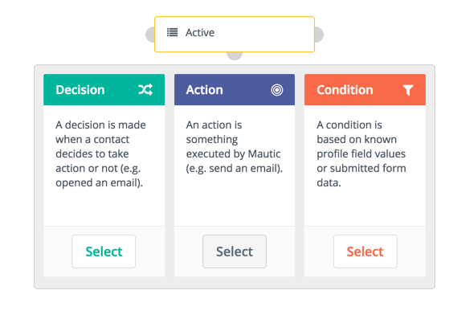
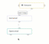

# Campaign Builder

The Mautic campaign builder gives you a blank canvas upon which to build your campaign workflow. The overall interface is clean and simple with easy to use events. These actions, decisions, or conditions can be added through clicking the "anchors" of events.

### Sources 

The first thing to be selected is where the campaign will pull in contacts from or contact sources. There are currently two options for contact sources: segments and forms. One or both can be added to the campaign.
 

After selecting one or more sources, the next step will be to add one or more actions (most likely), decisions and/or conditions:

### Actions

Campaign actions are those items which are initiated by you. These are items which you will control and which affect your contacts involved in the campaign. Examples of these actions are adjusting a contact's point totals, moving a contact to a different campaign, modifying the segments a particular contact is a part of, and lastly but perhaps most importantly sending of an email.

When you create a campaign you will select one of these actions to begin the workflow. In most cases this initial step will be an email sent to your segments.

You will notice that when you add an email to a campaign you will be able to select a potential *delay* for when the email is delivered. If the action is attached to a decision's non-action initiated decision path, the delay becomes how long the contact has to take action before the campaign progresses down the non-action path. 

After you have added an action you will more than likely place a decision on the campaign.

### Decisions

Decisions are actions which are initiated by the contact. These decisions can be either directly initiated or implied based on non-action. Samples of these decisions are downloading an asset, opening an email, submitting a form, or visiting a landing page.

Decisions are taken in response to an action and as such a decision has two outcomes.

These two options are demonstrated by the green and red decision points on the decision. Each path can then be handled by your campaign. This process is typically referred to as a **decision tree**.

__It is important to note that a contact must already be part of the campaign in order for it to recognize the decision executed. Therefore, campaigns should never start with a decision unless you are manually managing the contacts assigned to it and the decision is expected to be executed at a later time.__ 

#### Contact-initiated Decision Path (Green Points)

Actions attached to the green point of a decision are considered contact-initiated points.

The contact-initiated decision path is taken as a result of a contacts direct action such as opening an email or submitting a form. Connected actions will be executed (or scheduled if a delay is set) at the time the contact took the action. 

#### Non-action Initiated Decision Path (Red Points)

Actions attached to the red point of a decision are considered non-action points. This path is taken as a result of a contact NOT taking some direct action.

Use an action's delay settings to define at what point the campaign should send the contact down this path.

To trigger these events, see [Executing Campaign Actions](https://mautic.org/docs/en/campaigns/manage_campaigns.html#executing-campaign-actions).

#### Example

To provide a simple example of a decision tree consider an email where the decision is to open an email. There are two outcomes, if the contact chooses to open the email then the green decision point connects to the next action to be taken in the campaign workflow. If, however, the contact does not open the email then you may desire a different action to be taken (e.g. a delay of 30 days then a second email sent).

### Conditions

Conditions can be used to execute different actions based on a contact's data.  For example, a condition can be configured to execute an action if a contact has an email or do something else if they do not.

__The delay you set is ran before checking the condition no matter the delay you add on the connected actions. It will not wait the delay on the connected action to check the status of the condition to qualify the contact into the positive or negative path of the condition.__

Currently there are 2 types of conditions
1. Conditions based on Contact Field Value.
2. Conditions based on Form Field Value.

#### Positive status Condition Path (Green Points)

Actions attached to the green point of a condition are considered as positive status points.
The status condition path is taken as a result of the condition at the end of the delay set (trigger, delay or specific date).

#### Negative status Condition Path (Red Points)

Actions attached to the red point of a condition are considered as negative status points. This path is taken as a result of negative status for the condition at the end of the delay set (trigger, delay or specific date).
