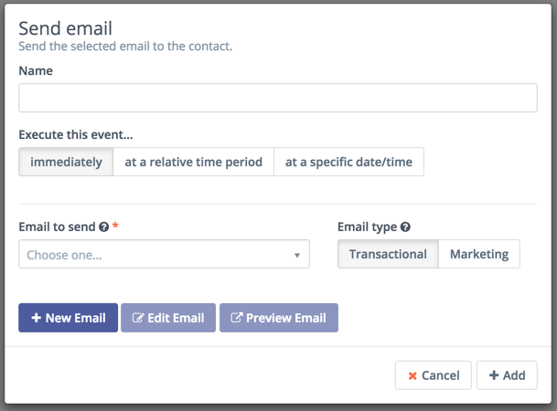
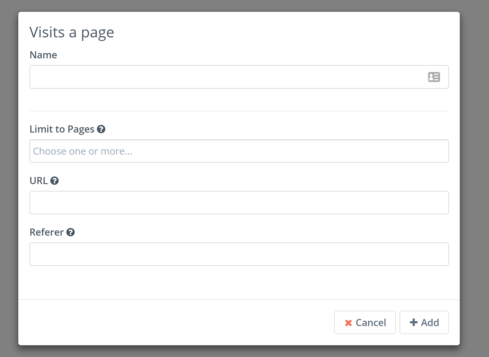

## Campaign Events

Below are notes on some of the specific campaign events.

### Campaign Actions

#### Send Email - Marketing vs Transactional

In the send email action, there is an option to select Transaction or Marketing. A transactional email is one that can be sent to the contact multiple times. A marketing email is one that can only be sent to the contact once across multiple sources (e.g. another campaign). If the contact has already received this email from another source or the current campaign, the email will not be sent again and the contact simply progresses on through the campaign.

#### Send email to user

This action will allow you to send email to:

- any Mautic user
- contact's owner
- any email addresses (TO, CC, BCC).

Emails sent through this action will not generate any statistics for contacts nor emails.

The email tokens will get populated with the real values including contact field values. But the email hash is bogus so the links like unsubscribe won't work correctly. It's similar behaviour like when a user sends itself a test email.

#### Send a Webhook

Action Send a Webhook with GET, POST, PUT, PATCH, DELETE, TRACE request support (curl). It was created based on [GitHub discussion](https://github.com/mautic/mautic/issues/854). Return true if page status code is 200/201. Data and headers values support contact field tokens (`{contactfield=firstname}` etc.).

Mautic 2.15.0 [adds](https://github.com/mautic/mautic/pull/6539) possibility to use contact's IP address as a token `{contactfield=ipAddress}`.

#### Delete contact

This action will **permanently delete the contact** who will trigger this action in your campaign flow, together with all the information Mautic knows about that contact. See in the [segment docs](./../contacts/managing_contacts.html#delete-all-contacts-in-a-segment) about how to use this action to delete all contacts in a segment.

##### The Delete contact action is special for 2 reasons:

1.  It will also delete the campaign event log record about that contact so this action will always show 0% progress in the campaign detail page. Even though it could have deleted some contacts. There is no record about it.

2. This action doesn't allow to connect other campaign events to it. There is no point in doing so since the contact won't exist after this action is triggered.

#### Focus items

See in the [Focus docs](./../focus/readme.html#focus-items-in-campaigns)

#### Update contact's primary company

Action added in Mautic 2.14 and allow edit contact's primary company via campaign. Read also about [Mautic's companies support](./../companies/index.html).

Action update contact's primary company based on company custom fields. 

If you try update company name, then action will add new or existed company with same name to contact and mark it as primary.

### Campaign Decisions

#### Opens Email

The opens email decision can only be attached to a send email action. Whatever email is sent through the action is the email used by the decision.

#### Visits a page

Note: The decision uses the OR operator between fields (Limit to Pages, URL, Referrer).

