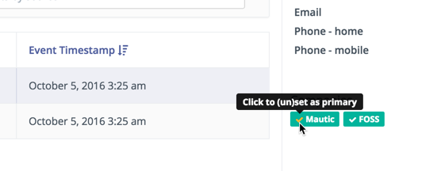

# Companies

Companies are a way to group contacts based on the company(ies) the contact works or has worked for.

### Merging Companies

When editing a company, you can merge this company into another existing company by using the **_Merge_** button.

Search for the company you wish to merge into and the fields from the current company that are not populated in the selected company will be copied to the selected company. Contacts that are not in the selected company will also be transferred.

After the current company has been merged into the selected company, you will be redirected to the selected company and the old company will be deleted from the database.

### Company Custom Fields

With Mautic's installation a set of custom fields is provided for companies, but you can customize these fields to your needs.

1. Go to _Custom Fields_ and create any company field you need.
1. Go to the right select box to assign this field to 'Company'.

### Company Segments

You can create a segment based on a company record, simply select any company field to filter with and the matching criteria for it, and contacts that match any company filtered will be added to the segment.

### Identifying Companies

Companies are identified strictly through a matching criteria based on Company Name, City, Country (and/or State). If city of country are not delivered as identifying fields to identify a contact, a company will not be matched or created.

### Campaign Company Actions

A contact can be added to a new company based on a campaign action

#### Create/Manage Companies

To create or manage companies, go to the companies menu identified by the building icon. In this area you can create, edit or delete companies.

#### Assigning Companies to Contacts

There are different ways to assign a company to a contact, all explained next:

##### Contact's Profile

You can assign a contact to companies in the contact's profile page when creating or editing an existing one. The latest company assigned will be treated as the primary company for the contact.

##### Contacts List View

You can batch assign companies to selected contacts in the contact's list view.

##### Through a Campaign

You can assign a company to identified contacts through a campaign by selecting the 'Assign contact to company' action.

##### When Identifying a Contact Through a Form

If a contact is identified through a form a company can also be identified/created if:

- Company name is selected as a form field (mandatory for company matching/creation).
- City is selected as a form field (mandatory for company matching/creation).
- Country is selected as a form field (mandatory for company matching/creation).
- State is selected as a form field (optional for company matching/creation).

### Company Scoring

A companies score can be changed through a campaign action or a form action. When one of these actions is selected, first a contact must be identified, and the companies assigned to that contact will have their score changed.

1. Select contact's _Change company score_ action in either a form or a campaign
1. Once a form is submitted or a campaign is triggered it will identify companies identified in the campaign or form to change its score.

### Setting Primary Company

As of [Mautic 2.3.0][release-2.3.0], it is now possible to set primary company through the Contact details page.

<!-- Page Links -->

[release-2.3.0]: <https://github.com/mautic/mautic/releases/tag/2.3.0>
