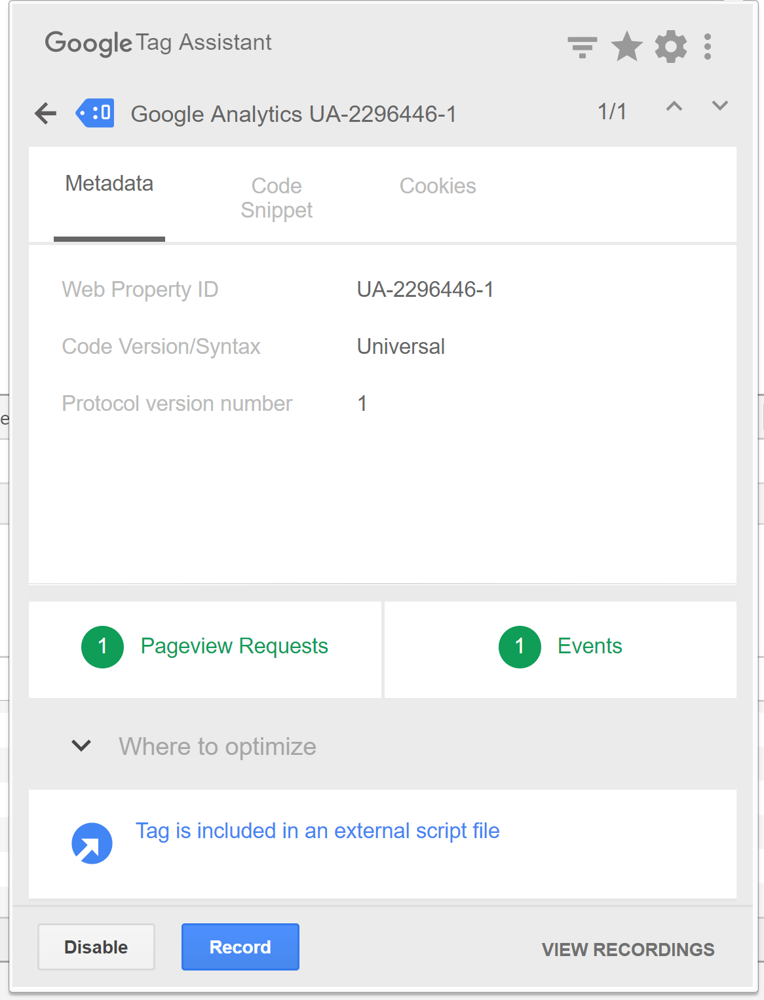
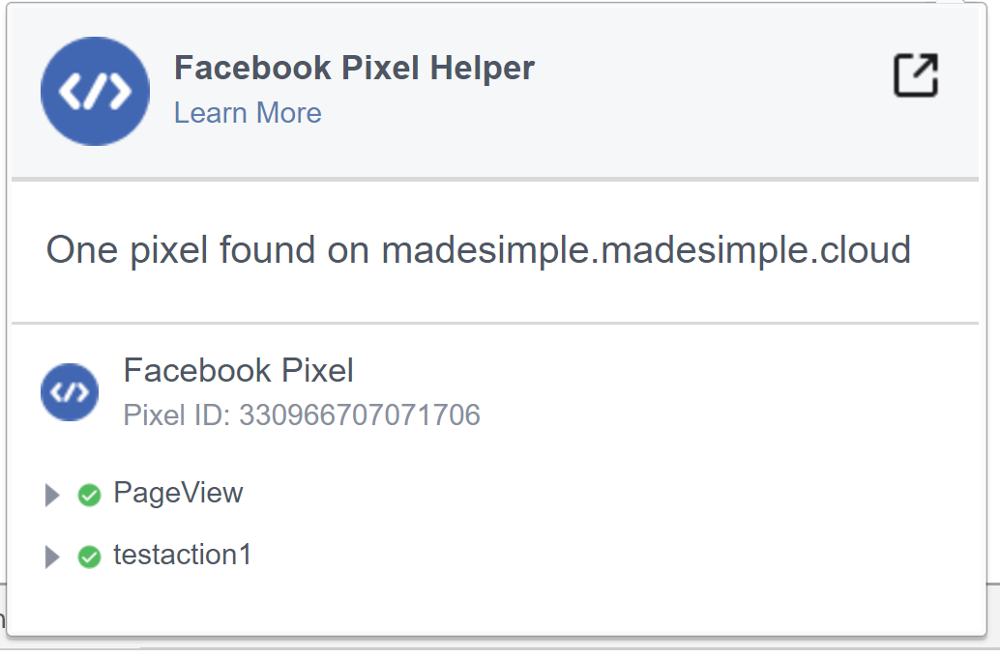

# Contact Monitoring
The act of monitoring the traffic and activity of contacts can sometimes be somewhat technical and frustrating to understand. Mautic makes this monitoring simple and easy to configure.

## Website Monitoring

Monitoring all traffic on a website can be done by loading a javascript file (since Mautic 1.4) or adding a tracking pixel to the website. It is important to note that traffic will not be monitored from logged-in Mautic users. To check that the JS/pixel is working, use an incognito or private browsing window or simply log-out of Mautic prior to testing.

Note that by default, Mautic will not track traffic originating from the same [private network](https://en.wikipedia.org/wiki/Private_network) as itself, but this internal traffic can be configured to be tracked by setting the `track_private_ip_ranges` configuration option to `true` in `app/config/local.php` and then [clearing the symfony cache](https://developer.mautic.org/#cache).

### Javascript (JS) tracking

JS tracking method was implemented in Mautic 1.4 and recommended as the primary way of website tracking. To implement it, 

1. go to Mautic > *Settings* (click the cogwheel at the top right) > *Configuration* > *Tracking Settings* to find the JS tracking code build for your Mautic instance
2. insert the code before the ending `<body/>` tag of the website you want to track

Or, copy the code below and change the URL to your Mautic instance.

As of 2.3.0, Mautic sets cookies with a lifetime of 2 years. Returning visitors are identified exclusively by the cookie. If no cookie exists yet, Mautic creates a new contact and sets the cookie. Make sure your website url is entered in the CORS settings. This is the first step in better contact identification. Note that if a browser is set to not accept cookies, this may result in each hit creating a new visitor. If this behavior is concerning, see Fingerprint option below. 

```
<script>
    (function(w,d,t,u,n,a,m){w['MauticTrackingObject']=n;
        w[n]=w[n]||function(){(w[n].q=w[n].q||[]).push(arguments)},a=d.createElement(t),
        m=d.getElementsByTagName(t)[0];a.async=1;a.src=u;m.parentNode.insertBefore(a,m)
    })(window,document,'script','http(s)://yourmautic.com/mtc.js','mt');

    mt('send', 'pageview');
</script>
```

_Don't forget to change the scheme (http(s)) either to http or https depending what scheme you use for your Mautic. Also, change [yourmautic.com] to the domain where your Mautic runs._

The advantage of JS tracking is that the tracking request which can take quite long time to load is loaded asynchronously so it doesn't slow down the tracked website. JS also allows to track more information automatically:

- **Page Title** is the text written between `</title>` tags.
- **Page Language** is the language defined in the browser.
- **Page Referrer** is the URL which the contact came from to the current website.
- **Page URL** the URL of the current website.

#### mt() Events

As of 2.2.0, mt() supports two callbacks, `onload` and `onerror` accepted as the fourth argument. The `onload` method will be executed once the tracking pixel has been loaded. If the pixel fails for whatever reason, `onerror` will be executed. 

```
mt('send', 'pageview', {}, {
    onload: function() {
        redirect();
    },
    onerror: function() {
        redirect();
    }
});
```

#### Local Contact Cookie

As of Mautic 2.2.0, if CORS is configured to allow access from the domain the mtc.js is embedded, a cookie will be placed on the same domain with the name of `mtc_id`. This cookie will have the value of the ID for the currently tracked contact. This provides access to server side software to the contact ID and thus providing the ability to integrate with Mautic's REST API as well.

Valid Domains for CORS are expected to include the full domain name as well as the protocol. (e.g. http://example.org). If you serve up secure and non-secure pages you should include both https://example.org as well http://example.org. All subdomains will need to be listed as well (e.g. http://example.org and http://www.example.org ), if your server allows this. If you would like to allow all subdomains, an asterisk can be used as a wildcard (e.g. http://*.example.org).

#### Tracking of custom parameters

You can attach custom parameters or overwrite the automatically generated parameters to the pageview action as you could to the tracking pixel query. To do that, update the last row of the JS code above like this:

```
    mt('send', 'pageview', {email: 'my@email.com', firstname: 'John'});

```
This code will send all the automatic data to Mautic and adds also email and firstname. The values of those fields must be generated by your system. 

Beginning in Mautic 2.13, the tracking code also supports company fields. Mautic can assign a company to your tracked contact based on company name. Then you have to add **company** or **companyname** parameter to tracking code along with other companies fields ( companyemail, companyaddress1, companyaddress2, companyphone, companycity, companystate, companyzipcode, companycountry, companywebsite, companynumber_of_employees, companyfax, companyannual_revenue, companyindustry, companyindustry, companydescription...):

```
    mt('send', 'pageview', {email: 'my@email.com', firstname: 'John', company: 'Mautic', companyemail: 'mautic@mautic.com', companydescription: 'description of company', companywebsite: 'https://mautic.com'});

```

#### Load Event

As the JS tracking request is loaded asynchronously, you can ask JS to call a function when a request is loaded. To do that, define a *onload* function in options like this:

```
    mt('send', 'pageview', {email: 'my@email.com', firstname: 'John'}, {onload: function() { alert("Tracking request is loaded"); }});

```

#### Fingerprint (beta feature)

Mautic 1.4.0 comes with a tracking feature called fingerprint. [Fingerprint2](https://github.com/Valve/fingerprintjs2) library was used. It should work together or replace current tracking identifiers like IP address and/or cookie ID. This method is not yet deeply implemented into the system, but you can already see more information in the timeline page hit events in the contact detail:

- **Fingerprint** - Unique hash calculated from browser settings and another environment variables.
- **Resolution** - Width x Height of the device display resolution.
- **Timezone Offset** - Amount of minutes plus or minus from UTC.
- **Platform** - Platform of the device. Usually OS and processor architecture.
- **Adblock** - A Boolean value whether contact uses an adblock browser plugin.
- **Do Not Track** - A Boolean value if DNT is turned on.

If you'd like to store any of the values above to a contact detail field, create a new custom field called exactly like the name in the list above and make the field publicly updatable. You can also try to make the Fingerprint field unique and this way you can simulate the future fingerprint tracking. It is not a tested feature though, do not use it on production unless you tested it first.

### Tracking Pixel tracking

This method is secondary since Mautic 1.4.

```
http://yourdomain.com/mtracking.gif
```

#### Tracking Pixel Query

To get the most out of the tracking pixel, it is recommended that you pass information of the web request through the image URL.  

#### Page Information

Mautic currently supports `page_url`, `referrer`, `language`, and `page_title` (note that the use of `url` and `title` are deprecated due to conflicts with contact fields).

### UTM Codes 

Support for UTM codes in the contact time-line was introduced in version 1.2.1. 
Currently, `utm_medium`, `utm_source`, `utm_campaign`, `utm_content`, and `utm_term` are used to generate the content in a new time-line entry.

`utm_campaign` will be used as  the time-line entry's title.

`utm_medium` values are mapped to the following Font Awesome classes:
 
<table>
<thead>
<tr>
    <th>Values</th>
    <th>Class</th>
</tr>
</thead>
<tbody>
   <tr><td>social, socialmedia</td><td>fa-share-alt if <code>utm_source</code> is not available otherwise <code>utm_source</code> will be used as the class. For example, if <code>utm_source</code> is Twitter, fa-twitter will be used.</td></tr>
   <tr><td>email, newsletter</td><td>fa-envelope-o</td></tr>
   <tr><td>banner, ad</td><td>fa-bullseye</td></tr>
   <tr><td>cpc</td><td>fa-money</td></tr>
   <tr><td>location</td><td>fa-map-marker</td></tr>
   <tr><td>device</td><td>fa-tablet if <code>utm_source</code> is not available otherwise <code>utm_source</code> will be used as the class. For example, if <code>utm_source</code> is Mobile, fa-mobile will be used.</td></tr>   
</tbody>
</table>

All the Utm tags are available in the time entry, just by toggling the entry details button.

Please note that UTM tags are recorded only on a form submission that contains the action "Record UTM Tags".

#### Embedding the Pixel

If you are using a CMS, the easiest way is to let one of our plugins do this for you (see below). Note that the plugins may not support all contact fields, utm codes or contact tags.

Here are a couple code snippets that may help as well:

HTML

```

```

PHP

```
$d = urlencode(base64_encode(serialize(array(
    'page_url'   => 'http://' . $_SERVER[HTTP_HOST] . $_SERVER['REQUEST_URI'],
    'page_title' => $pageTitle,    // Use your website's means of retrieving the title or manually insert it
    'email' => $loggedInUsersEmail // Use your website's means of user management to retrieve the email
))));

echo '';
```

Javascript

```
<script>
var mauticUrl = 'http://your-mautic.com';
var src = mauticUrl + '/mtracking.gif?page_url=' + encodeURIComponent(window.location.href) + '&page_title=' + encodeURIComponent(document.title);
var img = document.createElement('img');
img.style.width  = '1px';
img.style.height  = '1px';
img.style.display = 'none';
img.src = src;
var body = document.getElementsByTagName('body')[0];
body.appendChild(img);
</script>
```

### Contact Fields

You can also pass information specific to your contact by setting Mautic contact field(s) to be publicly updatable. Note that values appended to the tracking pixel should be url encoded (%20 for spaces, %40 for @, etc).

### Tags

The contact's tags can be changed by using the `tags` query parameter. Multiple tags can be separated by comma. To remove a tag, prefix it with a dash (minus sign).  

For example, `mtracking.gif?tags=ProductA,-ProductB` would add the ProductA tag to the contact and remove ProductB.

### Available Plugins

Mautic makes this even easier by providing key integrations to many existing content management systems. You can download and use any of the following plugins to automatically add that tracking pixel to your website.

* [Joomla!](http://mautic.org/integration/joomla)
* [Drupal](http://mautic.org/integration/drupal)
* [WordPress](http://mautic.org/integration/wordpress)
* [TYPO3](http://mautic.org/integration/typo3)
* [Concrete5](http://mautic.org/integration/concrete5)
* [Grav](https://github.com/mautic/mautic-grav)

These are just a few of the integrations already created by the Mautic community. More will be added in the future and developers are encouraged to submit their own integrations.

**Note:** It is important to note that you are not limited by these plugins and you can place the tracking pixel directly on any HTML page for website tracking.

### Identify visitors by tracking URL

Mautic 2.9 add to Configuration option for identifying visitors by tracking URL. If enabled, returning visitors will be identified by tracking URL from channels (especially from emails) when no cookie exists yet.

Note: Email contact field have to be marked as unique indentifier and publicly updatable in Configuration.

### Mobile Monitoring

The essence of monitoring what happens in an App is similar to monitoring what happens on a website. Mautic contains the building blocks needed for native (or pseudo-native) and HTML5-wrapper based Apps, regardless of platform.

In short, use named screen views (e.g. main_screen) in your App as your page_url field in the tracker, and the contact's email as the unique identifier, see next section for detailed instructions.

#### Steps in Mautic

1. Make the email field publicly editable, this means that a call to the tracking GIF with the variable email will get properly recognized by Mautic.

2. Setup a form, which will be the access point of your campaign (e.g. a new contact email). Make this form as simple as you can, as you will be POST-ing to it from your App. The typical form URL you will POST to is

```
http://your_mautic/form/submit?formId=<form_id>
```

You can get the ID from the mautic URL as you view / edit the form in the Mautic interface (or in the forms tables, last column), and you can get the form fields by looking at the HTML of the 'Manual Copy' of the HTML in the forms editing page.


3. Define in your campaigns the screens you want to use as triggers (e.g. 'cart_screen' etc.). Mautic is not looking for a real URL in the form 'http://<url>' for page_url, any typical string would do. Like this:

```
http://yourdomain.com/mtracking.gif?page_url=cart_screen&email=myemail@somewhere.com
```

#### In your App

A best-in-class approach is to have a class (say 'mautic') that handles all your tracking needs. For example, this sample method call would POST to the form with ID 3 - see previous section (note: for conciseness and ubiquity, these sample lines are written in JavaScript / ECMAScript-type language, use similar call in your mobile App language of choice).

```
mautic.addContact("myemail@somehwere.com",3)
```

And then, to track individual user activity in the App, this sample call would make an HTTP request to the tracker:

```
mautic.track("cart_screen", "myemail@somewhere.com")
```

Which is nothing more than an HTTP request to this GET-formatted URL (as also shown in previous section):

```
http://yourdomain.com/mtracking.gif?page_url=cart_screen&email=myemail@somewhere.com
```

Important: Make sure in your App, that the above HTTP request is using a cookie (if possible, re-use the cookie from the mautic.addcontact POST request prior) AND that you reuse this cookie from one request to the next. This is how Mautic (and other tracking software) knows that it's really the same user. If you can't do this, you may run into the (unlikely but possible) case where you have multiple contacts from the same IP address and Mautic will merge them all into a single contact as it can't tell who is who without a cookie.

### Google Analytics and Facebook Pixel tracking support

Mautic supports contact tracking in Google Analytics and Facebook pixel. Go to Mautic Configurations Tracking Settings tab and setup:

- [Google Analytics ID](https://support.google.com/analytics/answer/1008080?hl=en#trackingID)
- [Facebook Pixel ID](https://www.facebook.com/business/help/952192354843755)

Tracking codes support also [Google Analytics USERID](https://support.google.com/analytics/answer/3123662?hl=en) and [Facebook Pixel Advanced Matching](https://developers.facebook.com/ads/blog/post/2016/05/31/advanced-matching-pixel/) .

#### Campaign action Send tracking event

Action allow send custom event to [Google Analytics](https://developers.google.com/analytics/devguides/collection/analyticsjs/events) or [Facebook Pixel](https://developers.facebook.com/docs/ads-for-websites/pixel-events/) and depend on Visits a page decision.

##### How to test Google Analytics tracking code and campaign action

- Install [Tag assistent](https://chrome.google.com/webstore/detail/tag-assistant-by-google/kejbdjndbnbjgmefkgdddjlbokphdefk) and enable recording on your website 
- Create campaign with Visits a page decision and  Send tracking event action 
- Test it and see Tag assistent debug window with one Pageview request and 1 events



##### How to test Facebook Pixel tracking code and campaign action

- Install [Facebook Pixel Helper](https://chrome.google.com/webstore/detail/facebook-pixel-helper/fdgfkebogiimcoedlicjlajpkdmockpc) 
- Create campaign with Visits a page decision and Send tracking event action 
- Test it and see Facebook Pixel Helper debug window with one Pageview and one custom event action



Events should use for [Remarketing with Analytics](https://support.google.com/analytics/topic/2611283?hl=en&ref_topic=7185254) and [Remarketing for Facebook Ads](https://www.facebook.com/business/a/online-sales/custom-audiences-website)   


### Other Online Monitoring

There are several other ways to monitor contact activity and attach points to those activities. Website monitoring is only one way to track contacts. Other contact monitoring activities can consist of forum posts, chat room messages, mailing list discussion posts, GitHub/Bitbucket messages, code submissions, social media posts, and a myriad of other options.

### Troubleshooting

If the tracking doesn't work, take a look at [Page troubleshooting](./../pages/troubleshooting.html) or [Email troubleshooting](./../emails/troubleshooting.html)
