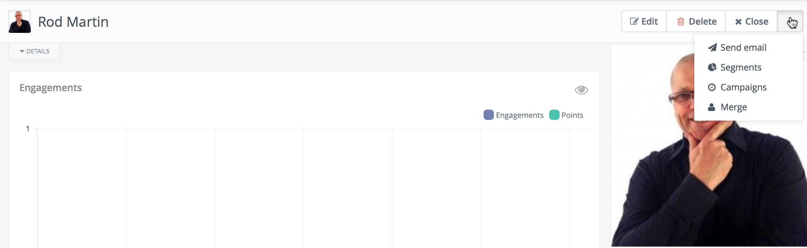

# Contact Overview

Each contact has a detail page where you can see what Mautic knows about them.

## Engagements/Points chart

The Engagements line chart display how active the contact was in the past 6 months. Engagement is any action the contact made. E.g. page hit, form submission, email open and so on. The chart displays also the points which the contact received.

## Avatar

Mautic will try to download the contact's avatar image based on their email address from the [Gravatar](https://en.gravatar.com/) service. But it can be loaded also from some social networks.

## History

The main tab displays the contact's action history sorted from the latest to the oldest. Each action will display as many details as there is about it. For example a form submission will display what values the contact submitted, the email send action will inform you whether the email was opened and when and so on. You can filter what actions you want to include or exclude from the timeline if you are searching for a specific one.

## Notes

Mautic can be used as a basic CRM. You or your teammates can write notes for a specific contact. A note can be marked with a specific purpose: General, Email, Call, Meeting. It's also possible to define a date of a meeting or a call. If you do so, the note will also appear in the Mautic calendar.

## Social

If the social plugins like Facebook or Twitter are enabled and authorized and the contact provided you a username for a social network, Mautic can display their feed for the social network in the Social tab. Most of the social networks limited their API since the feature was developed so search by email is not working.

## Map

If Mautic knows the coordinates of the contact from a geolocation IP lookup service, it will display a fourth tab with a map so you can easily see where in the world the contact is located. If Mautic knows more locations for this contact as they travel, you'll see all the locations there. If Mautic doesn't know any location, the tab won't show up.

## Change contact segments

Click the drop down box arrow in the top right hand corner of the contact detail. Select *Segments*. A modal box will show up where you'll see all the segments. The green switch means that the contact belongs to the segment, the orange switch means the opposite. Click the switch to add/remove the contact to/from the segment.

## Change contact campaigns

Click the drop down box arrow in the top right hand corner of the contact detail. Select *Campaigns*. A modal box will show up where you'll see all the campaigns. The green switch means that the contact belongs to the campaign, the orange switch means the opposite. Click the switch to add/remove the contact to/from the campaign.

## Merge two contacts

If you have 2 contacts in the Mautic database who are physically one person, you can merge them with the Merge feature. Click the drop down box arrow in the top right hand corner of the contact detail, select the *Merge* item, a modal box will show up. Search for the contact you want to merge into the current contact. The select box will update as you search. Select the right contact and hit the *Merge* button.

## Send email to contact

The drop down menu in the top right corner of the contact detail page also lets you send an email directly to the contact. You can fill in *From Name*, *From* (email address), *Subject* and the *Body* message. You can also *Import from an existing template*. If you select some email from this select box, the Subject and the Body textarea will be prefilled from that pre-defined email template. Emails sent by this method are not tracked by Mautic.
