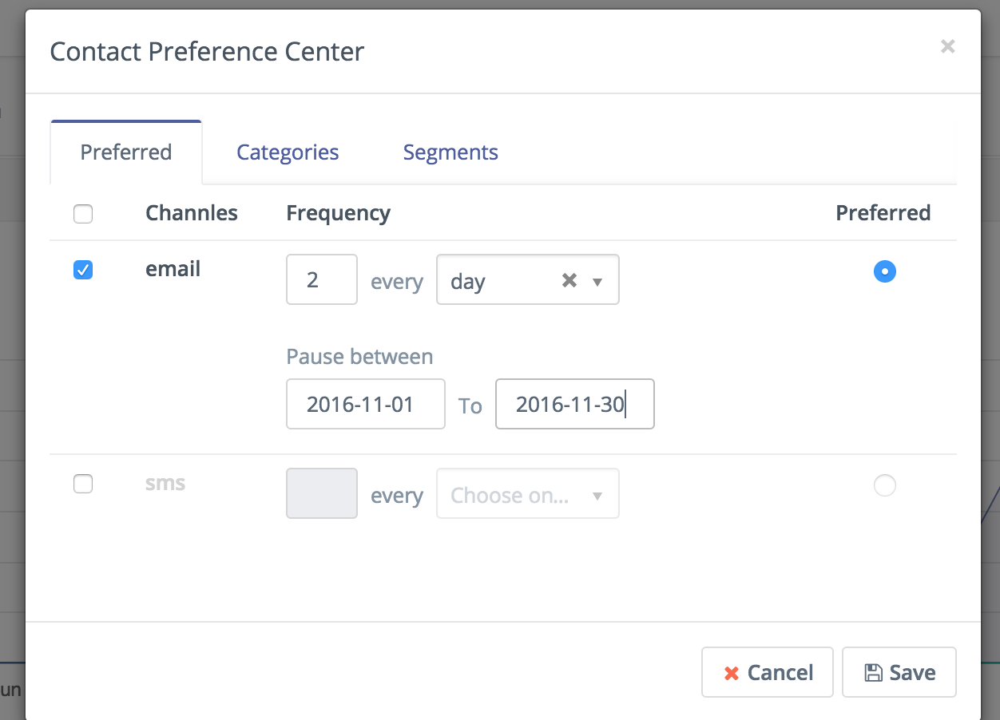
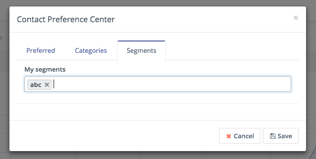
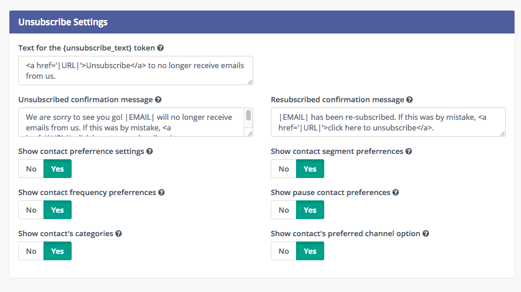

# Manage Contact Preferences

When managing a contact you can set the contacts preference of communication. You can access the contact's preference center when viewing a contact's profile. From the dropdown menu click on the preference menu. A new modal window should appear with a tab to set the preferred channels and frequency of contact, as well as the option to pause communication within a given period of time. The second tab will give the option to add or remove the contact from global categories used in emails or categories. The third tab will allow to add or remove the contact from segments it belongs to.

## Preferred Channels and Frequency

In this window you can enable/disable channels of communication, set the frequency of the communication via each channel enabled, and set one of the channels as a preferred channel.

To set a channel as a do not contact me through this channel, untick the tickbox next to the channel name in the first column. 

When a channel is selected, these will be used to send marketing messages if there is a message set for any of the channels selected. You can also set the frequency of the communication, as in this example the frequency is set to "Send me emails twice a day" but pause them during the "1st of november 2016 to the 30th of november 2016". Email is also set as the preferred channel, so if the same message is set for both email and sms, it will only send the email version of the message to the selected contact.

## Contact Categories

Use the categories tab to add or remove a contact from a global category. Global categories can be used in areas like emails, text messages, campaigns. In combination with the new Subscribed Categories segment filter, contacts can be given the choice to opt out of categorized communications.

## Contact Segments

Use the segments tab to add or remove a contact from a segment. Segments are used as a source for campaigns and emails. Any contact in a particular segment will be part of a campaign that has that segment as the source. You can also use a standalone email manually to a segment. If a user has opted out of a segment it will no longer receive campaign actions or messages sent to that segment.

## Contact's Unsubscribe Email Preferences

The contact's preferences can be presented to the user in the unsubscribe page by selecting "Show contact preference settings" in the email configuration. You may also choose to hide or show different segments of the user preferences. If any of these areas is set to no, it will hide it from the contact's personal preferences page. The default unsubscribe message is shown if the preference setting option is set to no.

You can also [Customize the preference center page for individual emails](customize_preference_center.md)
