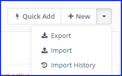
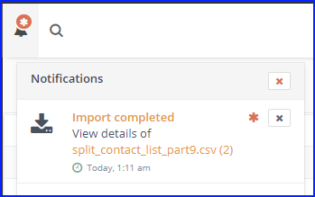
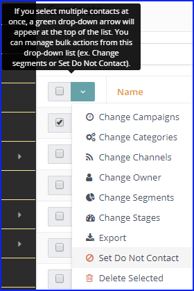

# Importing Contacts

Contacts can be imported via the user interface from a CSV file. You can import from the browser or in the background via a cron job.

> Background import is recommended.

Since [Mautic 2.9][release-2.9.0], when an import job creates or updates a contact, you'll see that action in the Contact events history.

## Import file requirements

- The CSV file must be in UTF8 encoding.  Other encodings may cause troubles while importing.  Read the documentation of your spreadsheet program on how to export a spreadsheet to UTF8. Google Sheets encodes to UTF8 automatically, Libre/Open Office lets you choose before export.
- For boolean values like `doNotEmail` or custom boolean field, use values `true`, `1`, `on` or `yes` as TRUE value.
    Anything else will be considered false.
- For date/time values, use [ISO8601] notation i.e. `YYYY-MM-DD hh:mm:ss`
    - Example: `2019-01-02 19:08:42`.
    <!-- For PHP DateTime notation: `YY-MM-DD HH:II:SS`) -->
    <!-- See MySQL in the Localized Notations at https://www.php.net/manual/en/datetime.formats.compound.php -->
    Other formats may work too, but they may be problematic.

### Tips

- Use a header row, with the column names matching the Mautic Contact [Custom Field][custom fields] names.  This way Mautic automatically pre-selects the mapping for you.  For example if you name the first name column as `firstname`, this field will be mapped automatically to [`{contactfield=firstname}`][variables].

- If your CSV contains thousands of contacts or more, divide such CSV into several smaller CSV files to avoid memory issues and slow import speed.

> **ProTip**
>
> If using a Linux system, see the GNU parallel command. (sudo apt install parallel)
>
> ```console
> cat big_contact_list.csv | parallel --header : --pipe -N 1000 'cat > split_list_part{#}.csv'
> ```
>
> This will generate files:
>
> split_list_part1.csv ...split_list_part9.csv, split_list_part10.csv ...

## Types of import

### Browser import

Larger CSV files have to be imported in batches to avoid hitting server (PHP) memory and execution time limits.  When importing in the browser, your browser is controlling the batches.  When one finishes, the javascript starts a new one. This means the browser window **has** to stay opened and connected to the internet the whole time.

Use the browser import method only if you don't have any other choice.  Background import is recommended.

### Background import

Background import jobs (CLI command triggered manually or via a cron job) have the advantage of benevolent time limits. A CSV background import is not restarted every batch (1 batch = 100 rows by default) - the last row imported is saved, and the next batch continues from that point.  Background imports will always be faster and more reliable than browser imports.

This option is available since [Mautic 2.9][release-2.9.0].

**Warning** background import require the command `php /path/to/mautic/app/console mautic:import` to run periodically. Add it to your [cron jobs][cron].

Successful result of the [background job][cron] can look like this:

```console
$ app/console mautic:import
 48/48 [============================] 100%
48 lines were processed, 0 items created, 48 items updated, 0 items ignored in 4.78 s
```

If there is no import waiting in the queue, there won't be any messages (or use `--quiet`).

### Automatic import type configuration

There is an option in the Global Mautic _Configuration_ / _Contact_ settings to define what is the optimal limit of browser import vs background import.  If you enter `500`, that means that if the CSV file being imported has less than 500 rows, it will be imported in the browser.  If it has more than 500 rows, it will be queued to be imported by the background job.  Default value is 0 (zero), which means it will show two Import buttons instead of one and you have to decide what import option to use during every import.

### Parallel imports

The import can take several minutes. It's possible that one import will still run when the other will be started. To prevent running out of server resources, there is the `parallel_import_limit` configurable option. By default only 1 import will run at the same time. This option can be changed when you add it to your `app/config/local.php` file.

## Import job list

The list of imports can be found when you go to the _Contacts_ area, open the action menu above the contacts table and choose the _Import History_ option.



   > **ProTip**
   >
   > The direct URL is `https://example.com/s/contacts/import/1`

The table will show you:

- basic statistics about all imports
- their [current status](#import-job-status)
- original CSV file names
- who created the import
- when it was created
- when the background job (System) last updated the statistics

There is also the toggle switch which will enable you to [stop and start](#starting-and-stopping-imports) **Queued** or **In Process** imports.\
This type of switch is used throughout the Mautic UI to publish and unpublish items.

### Import job status

There are several potential statuses for import jobs:

- **Queued** - The import was created and queued for background processing. At this stage the import is waiting for the background job to start the import.
- **In Progress** - The background job started the import and it hasn't finished yet. You can see the progress in the list of the imports.
- **Imported** - The import was successfully processed.
- **Failed** - The import failed for some reason. Most usual cause may be that the uploaded CSV file was removed or Mautic doesn't have permission to read it. Or the import was unresponsive for more than 2 hours.
- **Stopped** - The import has been stopped by the user when it was in the **Queued** or **In Progress** states.
- **Manual** - The user selected to import in the browser "manually". It's similar to **In Progress**.
- **Delayed** - The background job wanted to start the import, but the import process could not start. So it's delayed for later. The reason when this could happen is when the parallel import limit was hit. The import will start ASAP.

### Import job detail

Clicking on a filename opens the import job detail page.

The main content area displays information about rows which were ignored for some reason (if any).  The table will tell you what row in the CSV file it was and what was the reason, so you can fix those rows and [start the import](#how-to-start-an-import) again.

There are two charts:

1. The pie chart shows the ratio between created, updated and failed rows.
1. The line chart shows how many contacts have been added per minute.

More detailed statistics and the import job configuration are available if you click on _Details_.  This includes import speed, field mappings, and job timestamps.

## Starting and stopping imports

### How to start an import

1. Go to _Contacts_.
1. In the top right corner above the table of Contacts open the sub menu of actions and select the _Import_ option.
   > **ProTip**
   >
   > The direct URL is `https://example.com/s/contacts/import/new`
1. Select the CSV file with contacts you want to import.
1. Adjust the CSV settings if your file uses a non-standard delimiter or [encoding](#import-file-requirements) and so on.
1. Upload your CSV file.
1. The field mapping page should show up.  The first set of options will let you select owner, segment and tags to assign globally to all imported contacts.  The second set of options will let you map the columns from your CSV file to Mautic Contact [Custom Fields][custom fields].  The third set of options will let you map columns from your CSV file to special Contact attributes like _Date Created_ and so on.
1. When your field mapping is ready, click on one of the _Import_ buttons (described above).

### How to stop a background import

1. Go to _Contacts_.
1. In the top right corner above the table of Contacts open the sub menu of actions and select the [_Import History_](#import-job-list) option.
1. Unpublish the import job you want to stop.
    The import will change [status](#import-job-status) to **Stopped**.  It will finish importing the current batch and then stop.
1. To start the import again, simply publish it and the background job will continue with the next [cron job execution][cron].


When the background job finishes, either successfully or if it fails, you'll get a notification in Mautic's notification area about it.



## FAQ

Q: My import times out. What can I do about that?
A: Either use the background job to import or change the batch limit to smaller number than 100.

Q: If I import _Do Not Contact_ values, is that stored as a bounce or a unsubscription?
A: It is stored as a Manual Unsubscription. It is the same as if the Contact was marked as _Do Not Contact_ from the _Contacts_ page.



[cron]: <./../setup/cron_jobs.html>
[variables]: <./../setup/VARIABLES.html>

[custom fields]: <manage_fields.html>

[release-2.9.0]: <https://github.com/mautic/mautic/releases/tag/2.9.0>

[ISO8601]: <https://en.wikipedia.org/wiki/ISO_8601>
