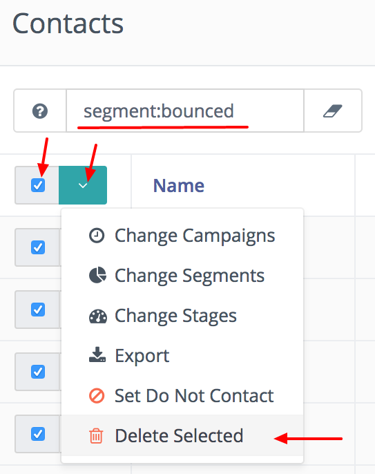

# Manage Contacts

The manage contacts page is the main interface through which you can view and interact with your contacts - both visitors and standard contacts.

## Segments

The segment is the default tabular view of all the contacts in the system - by default the **list view** is enabled, but you can also choose to switch to the **card view** (also known as **grid view**) which uses avatars to depict the contacts visually using cards. Using keyboard shortcuts you can enter "t" on your keyboard to dynamically switch to table view (default) and "c" to switch to the card view.

## Searching for contacts

A segment can be searched using the box at the top of the list, and can be ordered using the table headings by clicking on the heading you wish to sort the list by.

The search box allows many different search types and follows the same search process and variables as found in all other search layouts. You can learn more about the powerful search options available on the [search documentation page](/search/README.md).

## Adding contacts quickly

If you have contacts you would like to quickly add to Mautic manually, and they are not in the system as part of the normal workflow (for example by completing an enquiry form or having been imported) you can use the Quick Add Contact button to add them to the system.

You can of course also add them through the New Contact form and add much more detail, but for quick entry this is the easiest and fastest way to get the contact into the system.

## Adding contacts normally

Note: Before you start adding contacts, you may need to add [custom fields](/contacts/manage_fields.md) to capture all the information you require.

If you have contacts to import and you have time to add all the information, click on the dropdown arrow to the right of 'Quick Add Contact' and select 'New'.  This opens the new contact screen, where you can enter all the information you have about the contact.  Use the tabs at the top to populate existing custom fields and social network profiles.

## Importing contacts

Mautic offers the ability to import contacts from other sources via CSV file - this is a great way to get up and running quickly if you need to import a lot of contacts at once.

To use the import facility, make sure that you first have all the fields set up under 'Manage fields' which correspond to the information you are importing - you don't want to lose any data if at all possible.  You may need to add custom fields using the steps detailed [here](/contacts/manage_fields.md).

Once you have created all the contact fields, click on the dropdown arrow to the right of the Quick Add Contact button, and select 'Import'.

Upload your CSV file, and ensure that you match the delimiter, enclosure and escape characters so that the importer can understand the data.

When you click on 'Upload' you will have the opportunity to match the fields found in the CSV file to the fields that you have in Mautic, which will allow the data to be correctly imported.

Following values will result in TRUE when importing a Boolean value: `1`, `true`, `on` and `yes`. Those values can be also capitalized and still taken as TRUE. **Any other value will be saved as FALSE.**

## Editing contacts
To edit a contact, click on the name of the contact (or the IP address if the visitor is anonymous) to open the contact screen.

From this screen, you can view the recent events and any notes that have been made against the contact.

To edit the contact, click on the 'edit' button on the top-right menu.

## Contact duplicates

When Mautic tracks a contact's actions (such as page hits or form submissions), it will automatically merge the contacts by unique identifiers which are:
- IP address
- Email _(or any other contact field you mark as unique identifier)_
- Cookie

If Mautic knows only the IP address, it will merge the contact action (page hit, form submission etc.) with a contact with the same IP address. If the IP address does not exist in the Mautic database yet, it will create a new contact. But if Mautic knows the unique cookie, it will merge the actions to the contact with the same cookie or creates a new one.

If a contact sends a form with an email address, it will merge the submission with the contact having the same email address. Even if the IP address or the cookie matches another contact.

So, Mautic will take care of duplicate contacts created by the event tracking. You can, however, still create a duplicate contact via the Mautic administration. As of Mautic 2.1.0, you will be notified if there is already a contact with the same unique identifier.

## Batch Actions

There are batch actions you can carry out from the user interface. A modal window will be displayed when you click on one of the actions, with more configuration details. You can use this feature to quickly update large volumes of contacts, but it might be better to use a campaign action (e.g. add all the users you need to update into a segment and use a campaign to trigger the change) if you need to change more than a few hundred contacts at a time.

The following batch actions are currently available:

### Change Campaigns

Allows you to add/remove the selected contacts to/from campaigns.

### Change Categories

Allows you to add/remove the selected contacts to/from global categories.

### Change Channels

Allows you to subscribe/unsubscribe the selected contacts to/from communication channels (email, SMS, etc.) and also define frequency rules.

### Change Owner

Allows you to assign/unassign the selected contacts to/from an owner (a Mautic user).

### Change Segments

Allows you to add/remove the selected contacts to/from segments. Note that if a contact is added or removed to or from segment manually, then segment filters won't apply for them in that particular segment.

### Change Stages

Allows you to add/remove the selected contacts to/from a specified stage.

### Export

Allows you to export selected contacts to CSV.

### Set Do Not Contact (DNC)

This action will set all selected contacts as DNC for the email channel, and it allows you to provide a custom message as "reason" for why the contacts were manually unsubscribed by a Mautic user.

### Batch Delete

The batch delete action in the contact table allows the deletion of up to 100 contacts at a time. This limit is there as a performance precaution, since deleting more contacts at a time could cause performance degredation issues. 

If you need to delete large numbers of contacts, visit the [segment docs](./../contacts/managing_contacts.html#delete-all-contacts-in-a-segment) awhich explains how to delete thousands of contacts easily.
