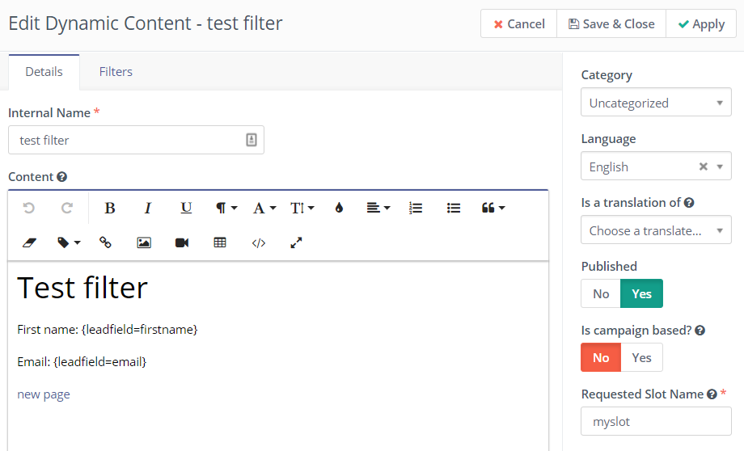
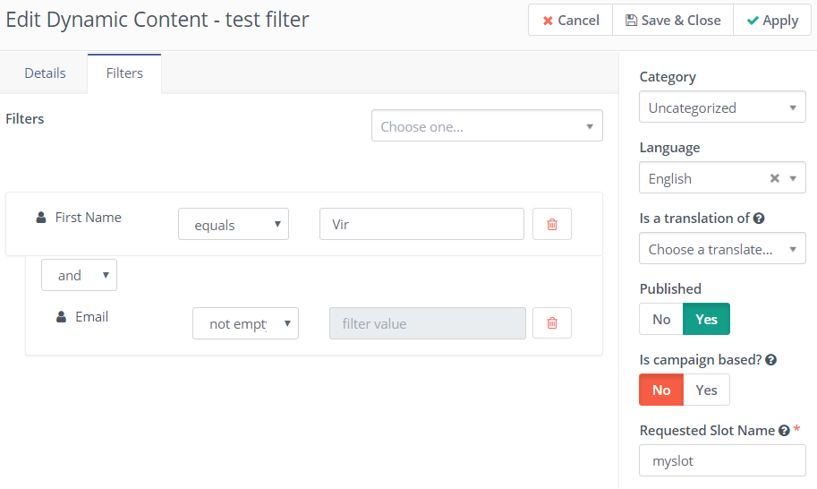
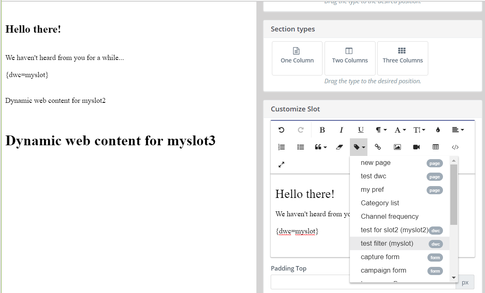
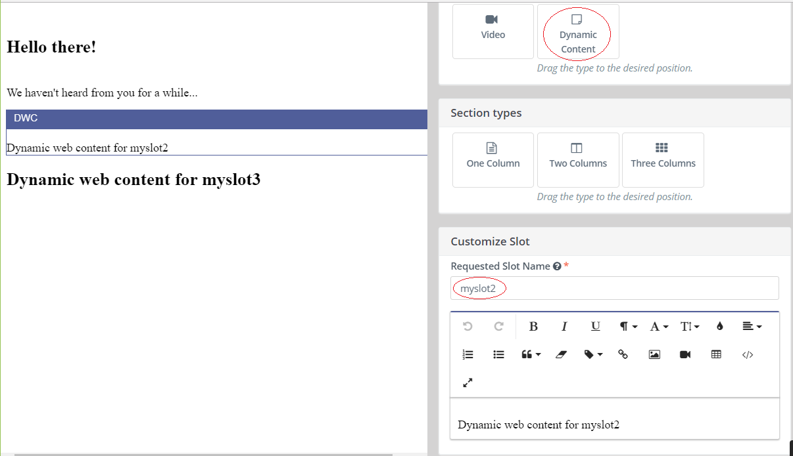
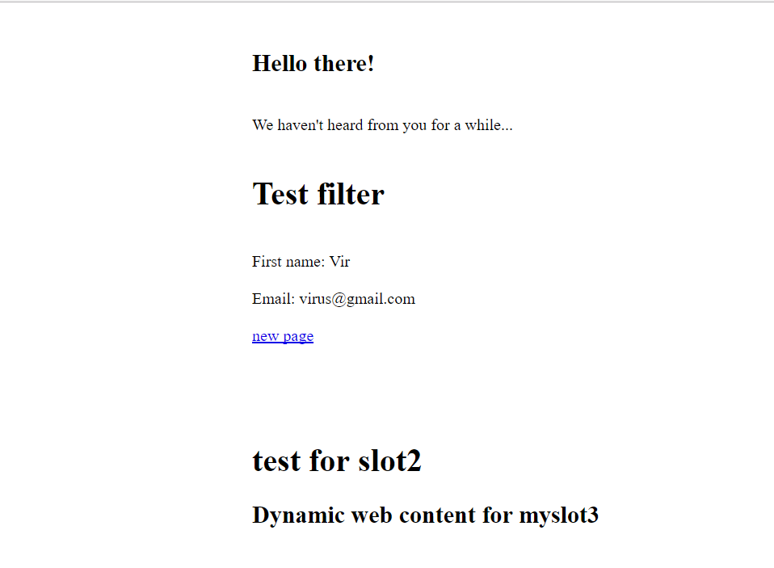
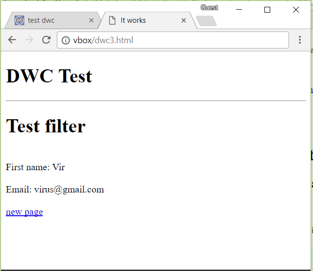
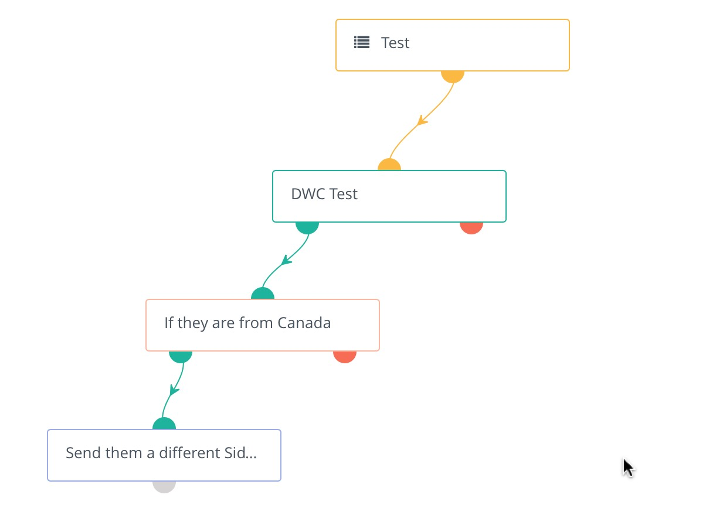

# Dynamic Web Content

[Mautic 2.0][release-2.0.0] introduced the ability to embed content on a web page dynamically for both anonymous visitors and known contacts.

There are 2 types of Dynamic Web Content items (or DWC):

## Filter based

This feature allows you to configure filters (like in segments) so a Landing Page with a DWC token or slot can show content based on specific conditions.

### Setup

1. Create or edit a Dynamic Web Content item.



2. Toggle the "*Is campaign based*" button to **No** (Notice how when No is selected, the "*Slot Name*" field is available and the filters tab is displayed so new filters can be created.



3. On a landing page, add a token or a slot for the new dynamic web content you just created.



4. When using DWC slots, you need to provide the requested slot name.



5. When someone visits the page and if the conditions on the filters are met, the DWC will be displayed.



6. To add a DWC item with filters in a third party page, you can use the following code (just change `myslot` in `data-param-slot-name="myslot"` to the *Requested Slot Name* of your DWC item):

```html
<div data-slot="dwc" data-param-slot-name="myslot">
  <h1>Dynamic web content for myslot</h1>
</div>
```

7. Again, when someone visits the page the DWC slot will be replaced if the filters match:



## Campaign based

There are several steps involved in setting this up.

### Add the default content


### Add alternative content if desired

You can set up as many items as you need.  The default will be delivered via the "Request Dynamic Content" decision in a campaign.  If you want to push something different based on a set of criteria, you create those here and deliver them via a "Push Dynamic Content" action.

### Add the dynamic content pull request in a campaign

The key to this step is naming the "slot".  This can be anything you want as long as it's unique across your dynamic content campaigns.  The pull request is processed and determines if the person on the landing page is a known contact.


### Add the push request in the campaign

If you want to serve up different information based on certain criteria, you can use a push request.

1. If the person is known, they receive the content from the pull request.
2. If they meet the criteria (in the example below - if they are from Canada), a different set of content can be delivered to the browser.
3. If they are unknown, they will see the information embedded in the dynamic web content div from the page (see below).



### Finally, include the dynamic web content shortcode in your web page

```html
<div data-slot="dwc" data-param-slot-name="dwc">
  <h1>Dynamic web content for myslot</h1>
</div>
```

Note the data-slot-name matches the slot name in the campaign.

Watch a [video tutorial][video tutorial].

## Translations

Dynamic web content supports translated content. When creating/editing a dynamic web content item, there are the options to set a language and select a translation parent. By selecting a translation parent, the current item is then considered to be a translation in the selected language of that parent item.

## Tokens

Dynamic web content supports these tokens:

- Contact Fields - example `{contactfield=firstname}`
- Page Link - example `{pagelink=1}`
- Asset Link - example `{assetlink=1}`
- Form - example `{form=1}`
- Focus Item - example `{focus=1}`

[release-2.0.0]: <https://github.com/mautic/mautic/releases/tag/2.0.0>
[video tutorial]: <https://www.youtube.com/watch?v=eChzJm5yBUk>
