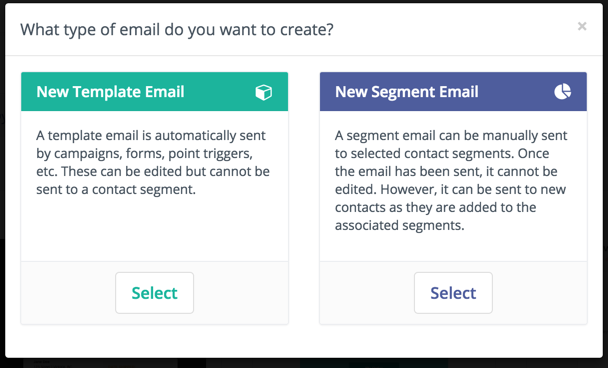

# Emails

Emails can be created to be used within campaigns and other list activities. Emails provide a means for direct interaction with potential customers, clients, and contacts.

### Email Types



There are two types of emails: template and segment (broadcasts). 
  
#### Template Emails

Template emails are transactional by default and can be used in campaigns, form submit actions, point triggers, etc. These can be sent to the same contact as many times as needed. These cannot be sent to a contact outside of another Mautic component except when sending an email directly to a contact in which the content is cloned (template emails sent directly to a contact are not associated with the template email itself and thus stats are not tracked against it).
 
#### Segment (Broadcast) Emails
  
These are marketing emails by default. Segments are assigned to the email which will determine which contacts receive the communication. Note that each contact can only receive the email once - it's like a mailing list.

Initiating these emails can be done in one of two ways. Prior 2.2.0, sending had to be manually initiated through the UI as an ajax process batched over the contacts. As of 2.2.0, a new cron job is available to do this for you! See [Send Scheduled Broadcasts (e.g. segment emails)](./../setup/cron_jobs.html#send-scheduled-broadcasts-e-g-segment-emails) for more details on this.

### Email Formats

Emails can be created in both full HTML as well as basic text format to be delivered as necessary to contacts. This is an important part of creating a strong relationship with contacts by providing relevant information in the correct format.

### Email Delivery

Emails are delivered using the method defined by the system administrator. If you are the system administrator for your company, then you will need to add the email protocol for your company to use. Mautic integrates with any email service provider which offers SMTP mail servers as well as several distinct services such as [Mandrill](http://mandrill.com/), [Gmail](http://gmail.com) [Sendgrid](https://sendgrid.com), [Mailjet](https://app.mailjet.com/signup?utm_source=mautic), [Postmark](https://postmarkapp.com/), [Sendmail](https://www.sendmail.com/) and [Amazon SES](https://aws.amazon.com/ses/).

The system can either send emails immediately or queue them to be processed in batches by a cron job.

#### Immediate Delivery ####

This is the default means of delivery. Mautic sends the email as soon as it is instructed to by the triggering action. If you expect a large number of emails to be sent, then utilizing the queue is recommended. Sending email immediately may slow the response time of Mautic if using a remote mail service since Mautic has to establish a connection with that service before sending the mail. Also attempting to send large batches of emails at once may hit your server's PHP limits or email limits if on a shared host. 
 
#### Queued Delivery ####

This is recommended if you plan to send a significant number of emails. Mautic will store the email in the configured spool directory until the command to process the queue is executed. Set up a cron job at the desired interval to run the command:

```
php /path/to/mautic/app/console mautic:email:process --env=prod
```

Some hosts may have limits on the number of emails that can be sent during a specified timeframe and/or limit the execution time of a script. If that's the case for you, or if you just want to moderate batch processing, you can configure batch numbers and time limits in Mautic's Configuration. 

 
### Email Fields

You have access to any number of contact fields to be used in your form emails. These can be easily placed within your emails and will be automatically replaced with the appropriate text once the email is sent.

### Tracking Opened Emails ###

Each email sent through Mautic is tagged with a tracking pixel image. This allows Mautic to track when a contact opens the email and execute actions accordingly. Note that this technology is limited to the contact's email client supporting HTML and auto-loading of images. If the email client does not load the image, there is no way for Mautic to know if the email was opened.

By default, the tracking pixel image is added at the end of the message, just before the `</body>` tag. If needed, one could use the `{tracking_pixel}` within the body content token to have it placed elsewhere.

### Tracking trackable links in emails ###

Clicks of each link in an email are tracked and those clicks count can be found at the bottom of email detail page under Click Counts tab.


### Unsubscribing ###

Mautic has a built in means of allowing a contact to unsubscribe from email communication. If using the builder, simply drag and drop the Unsubscribe Text or Unsubscribe URL tokens into your email. Or insert `{unsubscribe_text}` or `{unsubscribe_url}` into your custom HTML. The unsubscribe text token will insert a sentence with a link instructing the contact to click to unsubscribe. The unsubscribe URL token will simply insert the URL into your custom written instructions.

### Online version ###

Mautic manages also the hosting of an online version of the email sent. To use that feature, simply add the following as URL on text to generate the online version link `{webview_url}`.
