# Monitored Email
Since version 1.2.0 Mautic has provided a feature which allows monitoring of IMAP accounts to detect bounced emails and unsubscribe requests.

Note that Mautic makes use of "append" email addresses. The return-path or the list-unsubscribe header will use something like `youremail+bounce_abc123@your-domain.com`. The `bounce` or `unsubscribe` let's Mautic note what type of email it is when it examines the inbox through IMAP. The `abc123` gives Mautic information about the email itself, i.e. what contact it was it sent to, what Mautic email used, etc. 

Some email services overwrite the return-path header with that of the account's email (Gmail, Amazon SES). In these cases, bounce monitoring will not work. SparkPost, Mandrill, and Amazon SES (as of 2.2.0) support webhook callbacks for bounce management. See below for more details. 

## Monitored Inbox Settings
To use the Monitored email feature you must have the PHP IMAP extension enabled (most shared hosts will already have this turned on).  Simply go to the Mautic configuration and fill in the account details for the inbox(es) you wish to monitor.

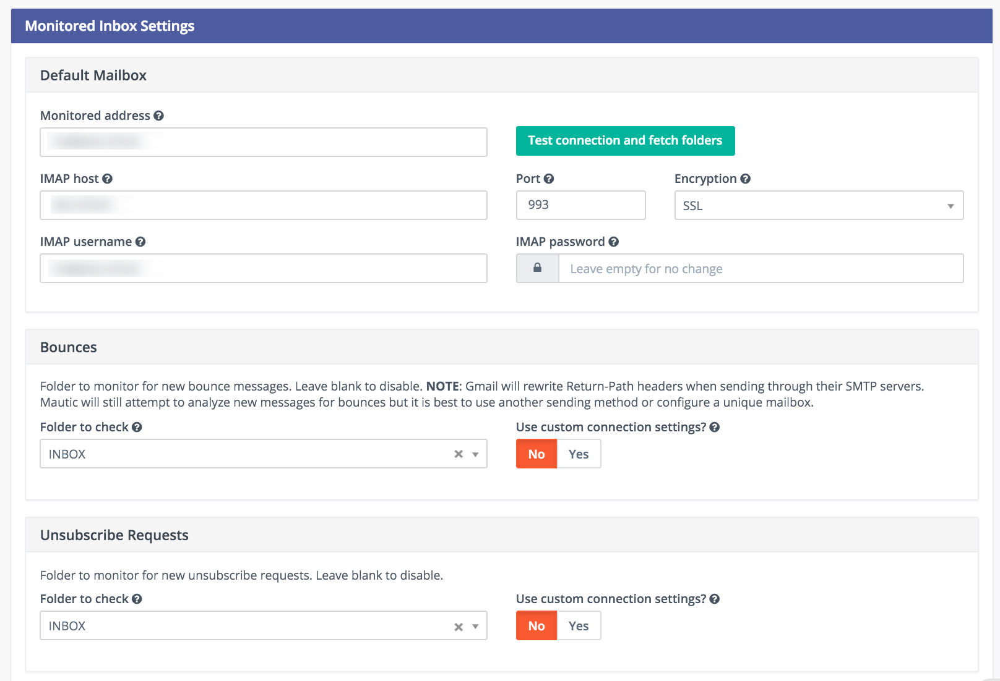

It is possible to use a single inbox, or to configure a unique inbox per monitor.

To fetch and process the messages, run the following command:

```
php /path/to/mautic/app/console mautic:email:fetch
```

Note that it is best to create an email specifically for this purpose, as Mautic will read each message it finds in the given folder.

If sending mail through Gmail, the Return Path of the email will automatically be rewritten as the Gmail address. It is best to use a sending method other than Gmail, although Mautic can monitor a Gmail account for bounces.

If you select an Unsubscribe folder, Mautic will also append the email as part of the "List-Unsubscribe" header. It will then parse messages it finds in that folder and automatically unsubscribe the contact.

## Create a segment with bounced emails

This is not required, but if you'll want to be able to select the contacts with bounced emails easily for example to delete all bounced contacts, create the segment with bounced emails.

1. Go to *Segments* / *New*.
2. Type in the segment name. For example *Bounced emails*.
3. Select the *Filters* tab.
4. Create new *Bounced Email* equals Yes filter.
5. Wait for the `app/console mautic:segments:update` command to be automatically triggered by a cron job or execute it manually.

All contacts with bounced emails should appear in this segment.

## Elastic Email Webhook

1) Login to your Elastic Email account and go to Settings -> Notification.

2) Fill in the Notification URL as http://your-mautic-url.tld/mailer/elasticemail/callback

3) Check  these actions:  Unsubscribed, Complaints, Bounce/Error

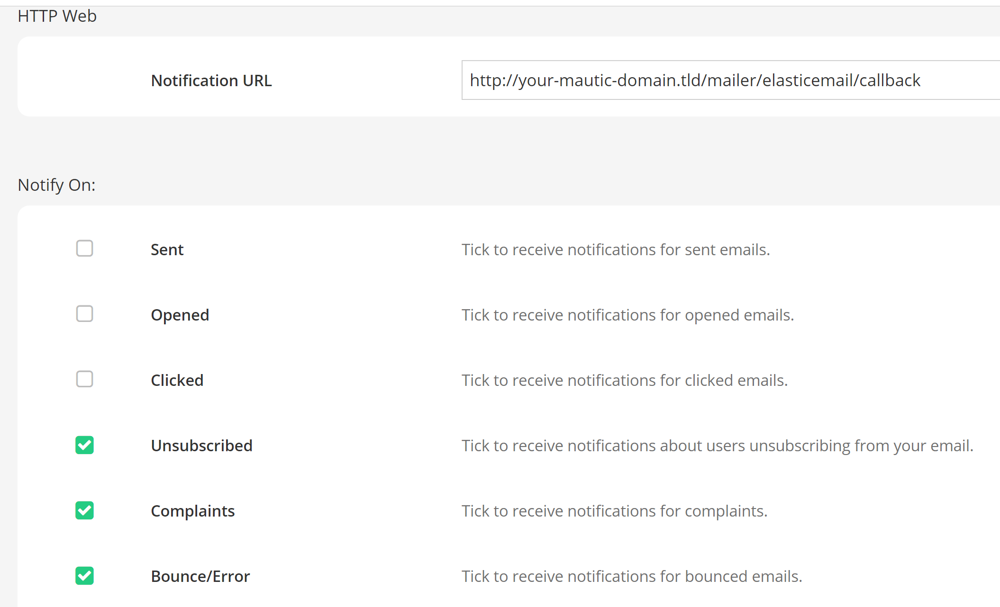

### Links

[Elastic Email Help & Support](https://elasticemail.com/support)
[Support via email](http://support.elasticemail.com/)

## Amazon Webhook
Mautic supports the bounce and complaint management from Amazon Simple Email Service (Amazon SES).

1) Go to the Amazon Simple Notification Service (SNS) and create a new topic

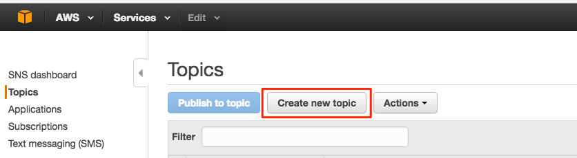

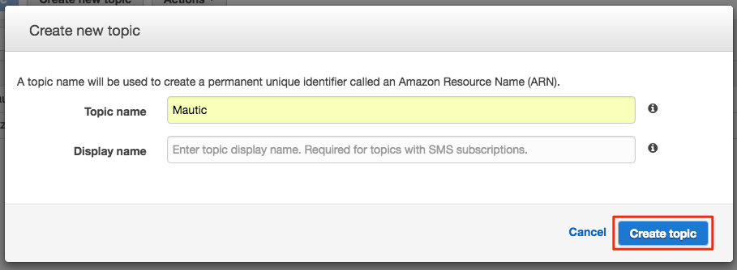

2) Click on the newly created topic to create a subscriber


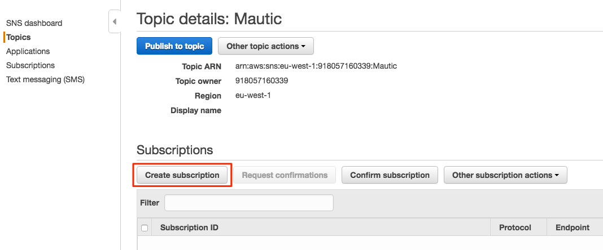

3) Enter the url to the Amazon webhook on your Mautic installation

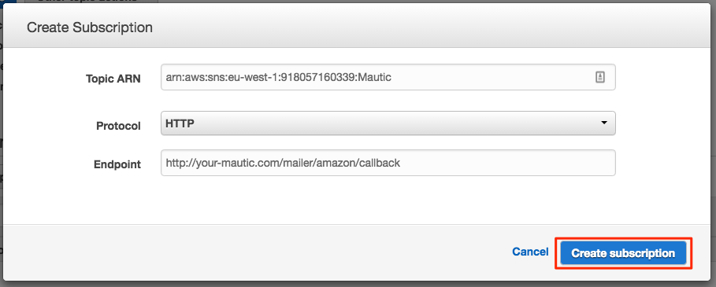

4) The subscriber will be in the pending state till it is
confirmed. AWS will call your Amazon webhook with a
SubscriptionConfirmation request including a callback url. To confirm
Mautic will send a request back to this callback url to validate the
subscription. Therefore make sure your Mautic installation is allowed
to connect to the internet, otherwise the subscription will remain in
the pending state and won't work. If your webhook is HTTPS, you also
need to make sure that your site is using a valid SSL certificate
which can be verified by Amazon.

Check the logfile for more information.  If you are having problems
getting the subscription out of the pending state, it may also help to
configure the topic's "Delivery status logging" settings, so that
delivery status (at least for HTTP/S) gets logged to CloudWatch.  Then
you can visit the Logs section of the CloudWatch Management Console
and see the exact details of delivery failures.  For example, an
invalid SSL certificate might result in an event like the following
appearing in the CloudWatch logs:

    {
        "notification": {
            "messageId": "337517be-f32c-4137-bc8d-93dc29f45ff9",
            "topicArn": "arn:aws:sns:eu-west-1:012345678901:Mautic",
            "timestamp": "2019-05-31 15:34:13.687"
        },
        "delivery": {
            "deliveryId": "a5dab35d-83f9-53c3-8ca6-e636c82668d4",
            "destination": "https://my.mautic.site/mailer/amazon/callback",
            "providerResponse": "SSLPeerUnverifiedException in HttpClient",
            "dwellTimeMs": 42266,
            "attempts": 3
        },
        "status": "FAILURE"
    }

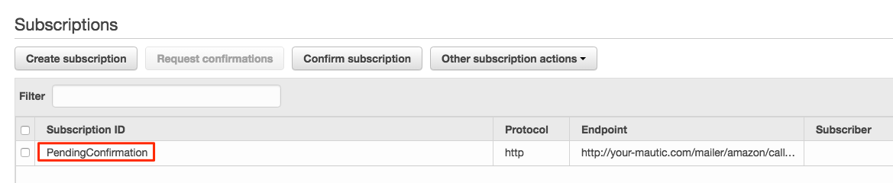

5) The last step is to configure Amazon SES to deliver bounce and complaint messages using our SNS topic.

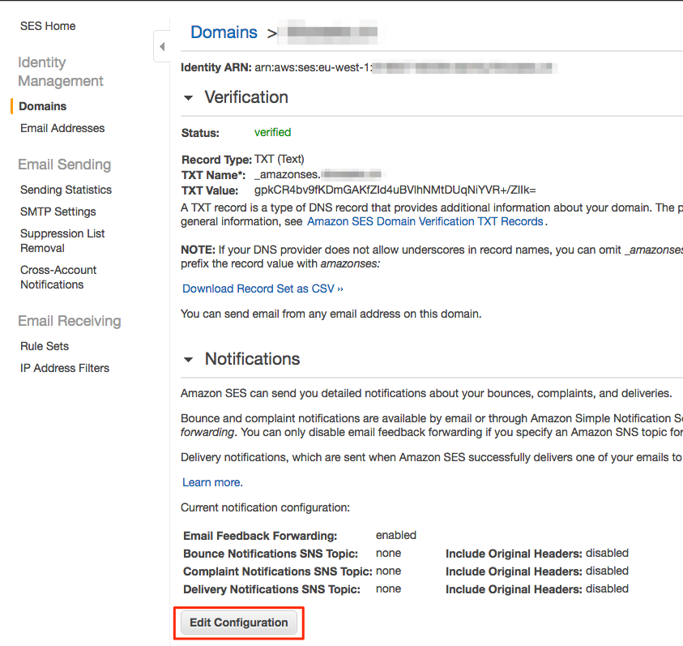

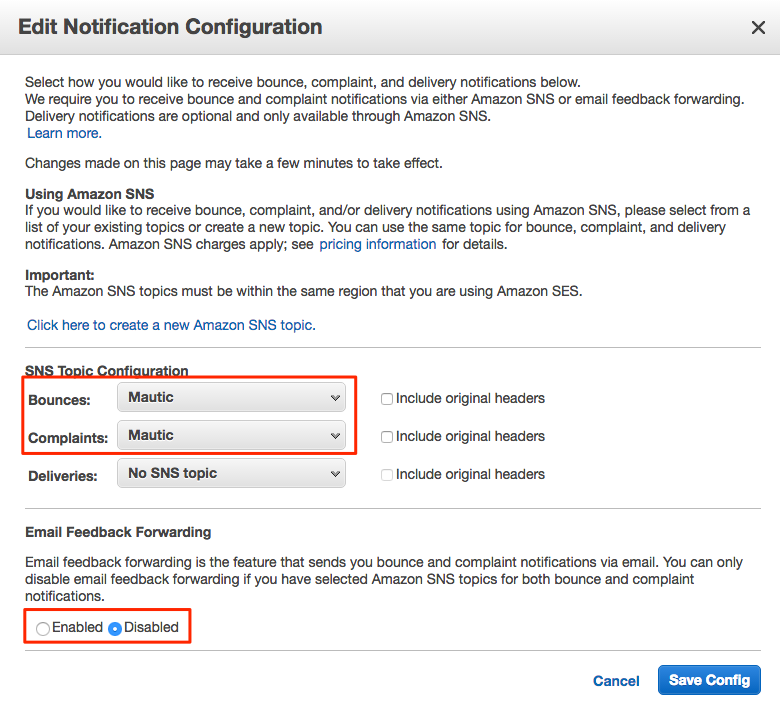

## Mandrill Webhook

Mautic supports a few of Mandrill's webhooks for bounces.

1) Login to your Mandrill account and go to Settings -> Webhooks

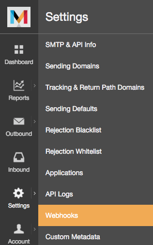

2) Click Add a Webhook

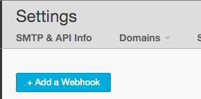

3) Mautic 1.2.2 supports the following webhooks: Message is Bounced, Message is Soft-Bounced, Message is Rejected.  As of 1.2.3, Message is Marked as Spam and Message Recipient Unsubscribes will be supported.

4) Fill in the Post To Url as `http://your-mautic.com/mailer/mandrill/callback` then click Create Webhook.

5) Click Custom Metadata and create two new metadata fields: `hashId` and `contactId`

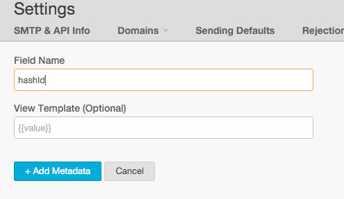


## Mailjet Webhook

Mautic supports Mailjet's webhooks for bounces, spam and blocked. Before any configuration, you'll need to create an account on [Mailjet](http://www.mailjet.com/).

1) Login to your Mailjet account and go to My Account -> Event tracking (triggers)


2) On the event type list, select the one you want to link to your Mautic account


3) Mautic 2.2.0 supports the following webhooks: Message is Bounced, Message is Blocked, Message is Spam.

4) Fill in the URL boxes as `http://your-mautic.com/mailer/mailjet/callback`.

## Sparkpost Webhook

1) Login to your Sparkpost account and go to Account -> Webhooks.

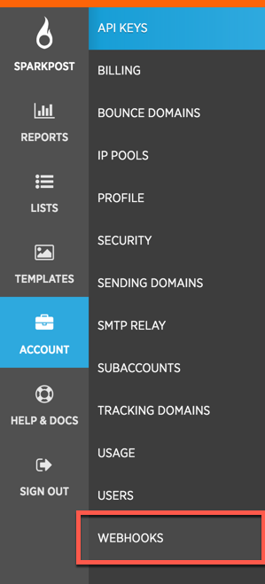

2) Click the New Webhook button top right

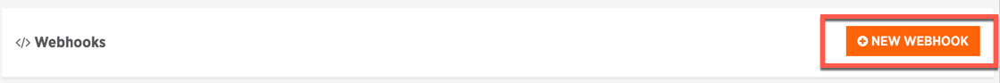

3) Fill in the Target URL as `http://your-mautic.com/mailer/sparkpost/callback`

4) Select the following Events

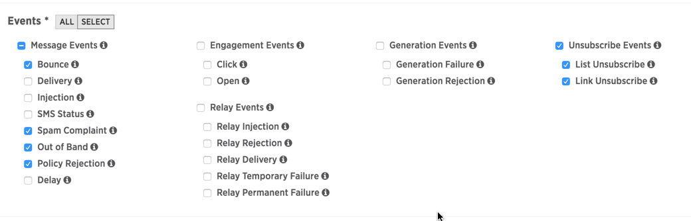

## SendGrid Webhook

1) Login to your SendGrid account and go to Settings -> Mail Setting -> Mail Settings

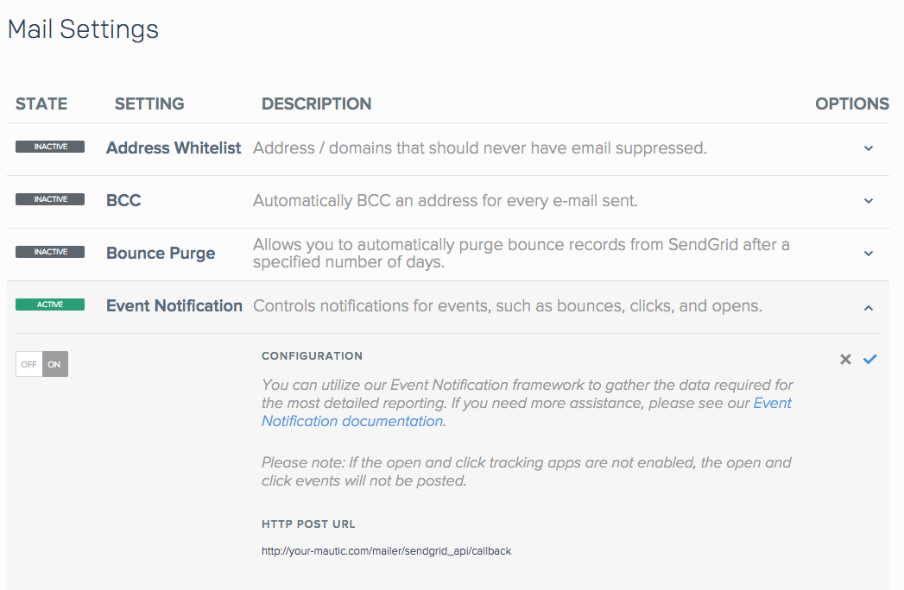

3) Fill in the Target URL as `http://your-mautic.com/mailer/sendgrid_api/callback`

4) Select the following Events

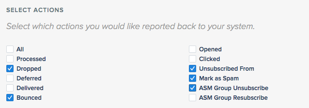

5) Save setting (on the right side of "Event Notification" row:

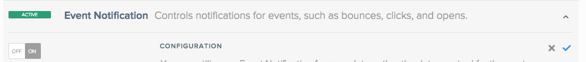
