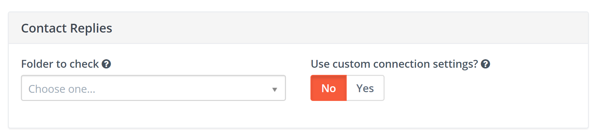
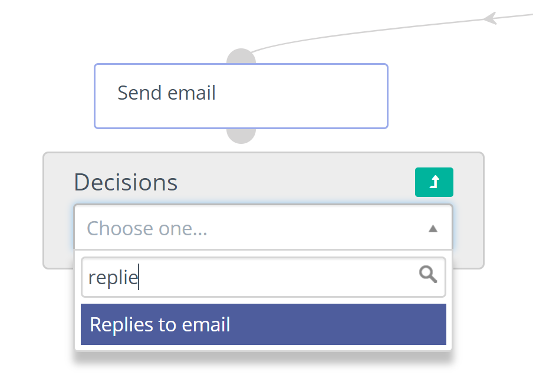

# Contact Replies

## Setup
Contact Replies were added in Mautic 2.12.0. To use it you must have access to a non-Google or Yahoo email IMAP server as they will overwrite return paths.

To use the Monitored email feature you must have the PHP IMAP extension enabled (most shared hosts will already have this turned on).

Configure all Mautic sender/reply-to email address as send copy to to one single inbox (the most of the email providers  support this feature in their configuration panel).  

Note that it is best to create an email specifically for this purpose, as Mautic will read each message it finds in the given folder.

Then go to the Mautic configuration and setup the inbox to monitor replies.



To fetch and process the read messages reply, run the following command:
```
php /path/to/mautic/app/console mautic:email:fetch
```

## Usage

Contact replies use with campaigns as decision after send email. Mautic tried read inbox, parse messages and find reply from contact. Then go to positive path immediately after reply exist. 



