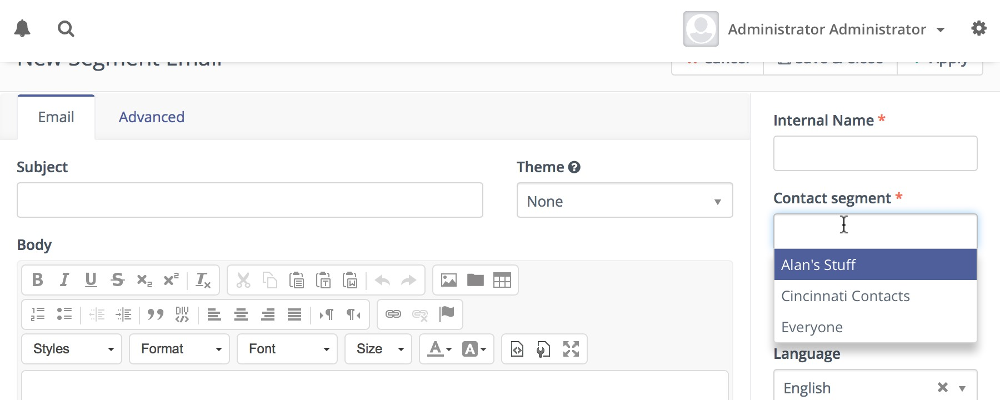
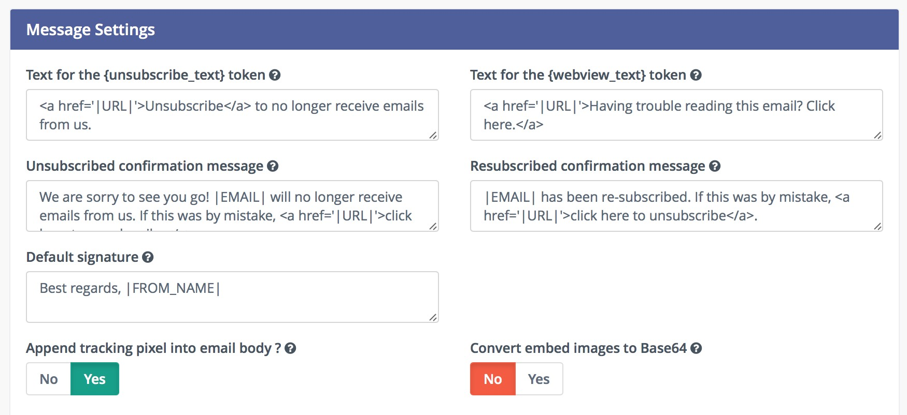

# Manage Emails

### Email Overview

The email overview allows at-a-glance information regarding the success or failure of a particular email. You can quickly see relevant information in regards to opens, bounces, successful click-throughs and other important statistics.

### Email Creation

Email creation can be handled through the graphical email builder with little to no HTML knowledge. Emails are assigned to particular segments and/or campaigns. Below are some key steps to be performed when creating an email.

### Translations

When creating the email, an option is given to assign a language and a translation parent. By selecting a translation parent, the current item is then considered to be a translation in the selected language of that parent item. If a contact has a preferred language set, they will receive the translated version in their preferred language if it exists. Otherwise, they will receive the parent in the default language. 

It is also possible to have translations of A/B test variants.

### Segments

When creating an email you can select the segments to which you want to send the email.

This entry field is a multi-select which allows you to choose several segments if necessary.

### Email Builder

The email builder is a graphical user interface to create an HTML email through the use of drag-and-drop tools. 

Since Mautic 2.7.0, the builder will let you drag the predefined content sections from the right hand toolbar and drop them to the position you choose. It's possible to select from layout of 1, 2 or 3 columns. The existing sections can be re-ordered or removed.

The email builder provides quick and convenient access to assets, landing pages, and other extra fields which are considered important or commonly used. All those are accessible via tokens in format `{component=item}`, for example `{contactfield=company}`. A drop-down with options will appear when you type `{` character and you can search for the right token by typing its name. For example if you type `{comp`, it will suggest the right token for the Company Contact Field and you can select it via keyboard or by clicking on it.

Tokens can be used also for the Subject line, but there is no drop-down. You'll have to type it yourself or select it in the email body and copy-paste it to the subject field.

Email Builder has also special tokens for the Unsubscribe link, Webview link and the Tracking pixel:
- `{unsubscribe_text}` - Creates a link with the unsubscribed URL and the text defined in the Mautic configuration.
- `{unsubscribe_url}` - Creates a URL to the unsubscribed page which can be used in a link's href attribute.
- `{webview_text}` - Creates a link with the webview URL and the text defined in the Mautic configuration.
- `{webview_url}` - Creates a URL to the webview page which can be used in a link's href attribute.
- `{tracking_pixel}` - Creates a 1 pixel image that allows to track email open.

Tokens can be used in the email's "from address" field.

#### Contact token modifiers

##### Default value

A token can have a default value for cases when the contact doesn't have the value known. The default value can be specified after `|` character like this: {contactfield=company|Default text}.

##### Encoded value

Embed the tokens as `{contactfield=FIELDALIAS|true}`. The |true tells Mautic to encode the value used for example in urls.

##### Date format

For custom date fields use:

- `{contactfield=DATEFIELDALIAS|datetime}`
- `{contactfield=DATEFIELDALIAS|date}`
- `{contactfield=DATEFIELDALIAS|time}`

Your date will displayed as human reading format taken from  Configuration > System Settings

- Default format for date only  
- Default Time Only Format 

### Tracking Pixel

The tracking pixel image is usually appended to the email message, if enabled. If needed, one could insert the tracking pixel image with the special token `{tracking_pixel}` at any place other within the text body. Beware that it should not be inserted directly after the opening `<body>` because this prevents correct display of pre-header text on some MUAs.

### Code Mode

[Go to the Code Mode docs](./../themes/code_mode.html).

### Base64 Encoded Images

Since Mautic 1.4, there is a new option in the Mautic configuration, the Email Settings tab. You can let Mautic encode all images in the email text as base64. It will attach the image inside the email body. It has several implications:

- The main idea with this option is that most of the email clients will display the images directly without any approvals.
- However, some email clients like Gmail will require the approval because of the tracking pixel and won't display the base64 encoded images anyway. See the next paragraph for possible solution.
- The email body will increase significantly if the email contains many and/or big images. Some email clients like Gmail will "clip" such email and won't display it directly.

### Disable the Tracking Pixel

As described above, some email clients display the image approval if one of the images is loaded from remote location. Like the tracking pixel. If you care more about this approval than the email open tracking, you can disable the tracking pixel. Then the images should be displayed directly without any approval.
