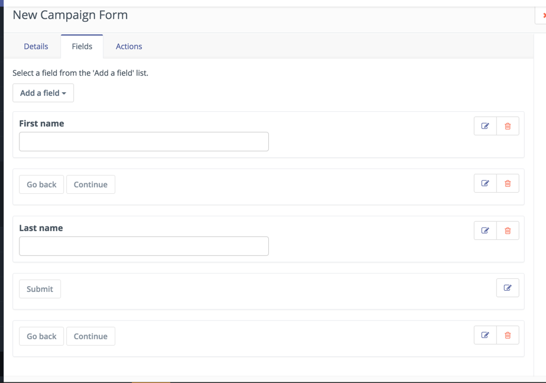
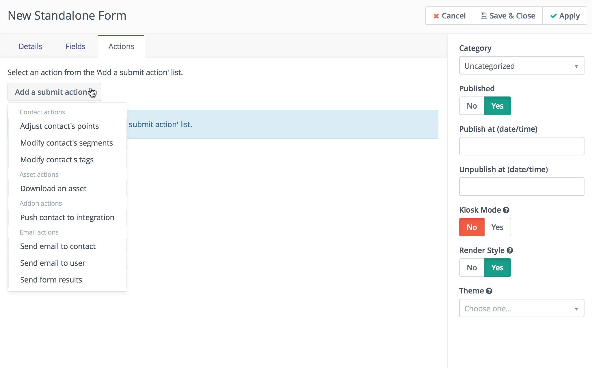
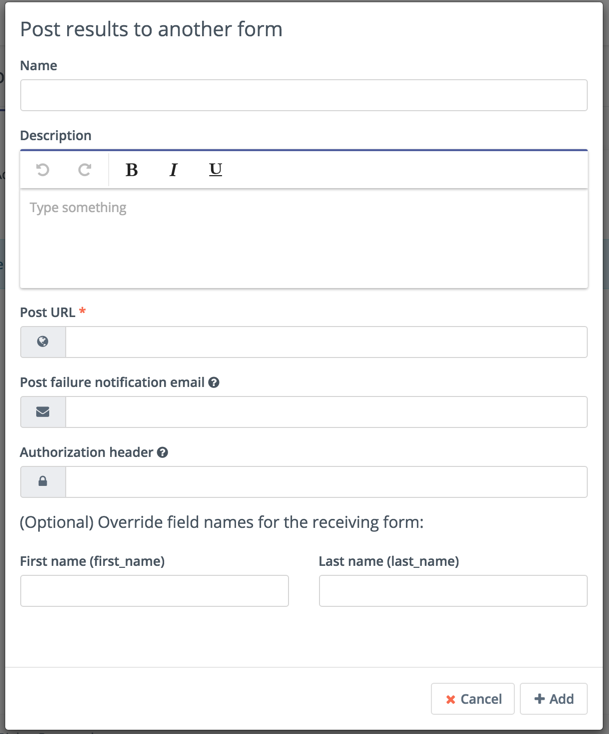
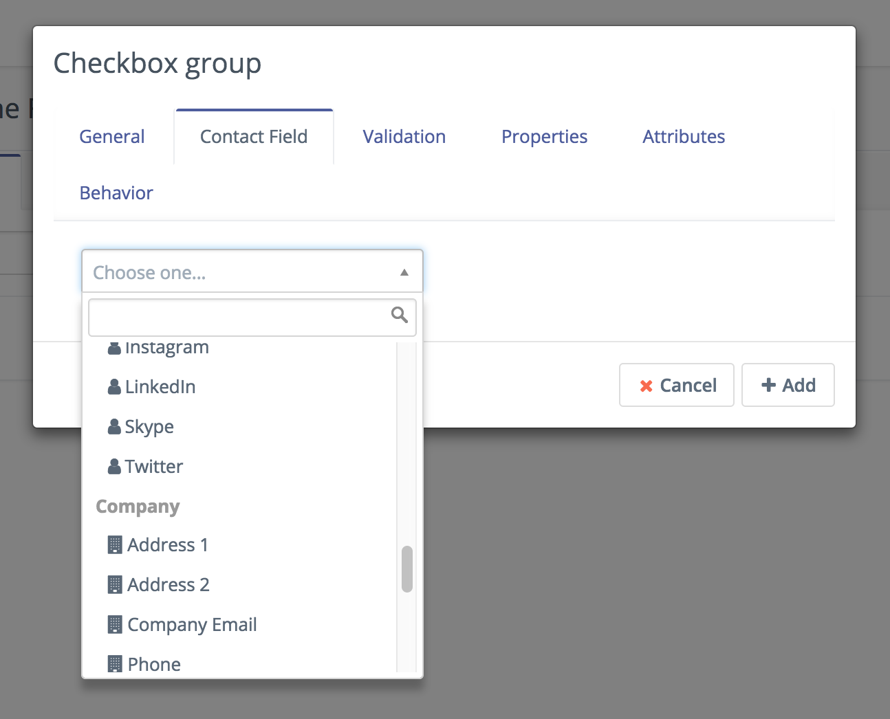

# Manage Forms

The new form view lets you create a form and attach any fields you want to collect from your users. After you've created the fields you can then define what actions you want to perform after the user submits the information.

### Form Overview

The form overview provides a quick overview of the submissions received over a time period to easily analyze how successful a particular form is. The bottom of the form overview outlines the fields and actions included as part of a particular form.

### Form Fields

A form can contain as many fields as needed. These fields can be laid out dynamically by the system or handled via HTML if you want more control.

![new-form][new-form]

[new-form]: <media/new-form.png>

#### Page Breaks

Page breaks is a new feature in [Mautic 2.2.0][release-2.2.0] that allows multi-paged forms. Note that the submission does not happen till the final page and the submit button is pressed.

Each page break will add a customizable continue/back button that will navigate to the next or previous page. If a page break is added after the submit button, the continue button will be replaced with the submit button itself when the form is generated.



### Form Actions

Form actions are items to be handled on the submission of the form. You can define multiple actions to be performed on each submission. As of [Mautic 2.2.0][release-2.2.0], different actions are available based on form type.



#### Form Re-Post Action

Results from a Mautic form can be re-posted to a 3rd party form using the new "Post results to another form" submit action.

An email can be configured to send the results if the form fails to forward.

Each form field can be have it's name customized to match that of the recipient _form/script_.

In addition to the form data, an array of `mautic_form` with details like ID, name, and the URL the form was submitted to (if available) along with `mautic_contact` with the details of the contact that submitted.



### Creating and Updating Contacts and Companies with Forms

To have your form create or update contacts (in order to update, there must be a matching unique identifier). Each form field can be mapped to a custom contact field through the form's Contact Field tab. Some fields result in automatic matching such as email and country.

As of [Mautic 2.10.0][release-2.10.0] you are now able to match form fields with company fields in order to create a company and link it to the contact created through the form. You will only be able to create a company if the company name field is populated. It will update the company if it can identify it through Company Name and Country, City and State.


As of [Mautic 2.2.0][release-2.2.0], for fields that include select lists (select, radio, checkboxes), options can be synced with the contact field itself. No more having to manually keep them in sync! If a custom field's list is updated, simply rebuild the form's HTML.


#### Kiosk mode

The kiosk mode is helpful when you know that some form will be submitted from one device by multiple contacts. For example like a kiosk at a conference. When the kiosk mode is turned on, each submission will create a new contact. When kiosk mode is turned off, Mautic will edit the contact which belongs to the current session.

#### No index mode

In [Mautic 2.15.0][release-2.15.0], [Mautic][mautic] introduced the ability to disable search engines from indexing forms. With this option you can disable search engines from indexing `https://example.com/form/{formid}` if set to "Yes".

### Form Injection

There are three ways you can use the form. You can copy the entire output or you can have the form injected dynamically using the provided javascript. These are two options for directly including the form on a page, you can alternatively embed the form directly in a Mautic landing page if you choose.

![form injection][injection]

[injection]: <media/injection.png>

> **ProTip**
>
> **It is recommended NOT to paste the injection code twice, it risks creating troubles on the submit form action when mandatory fields are submitted empty.**

```html
<script>
    (function(w,d,t,u,n,a,m){w['MauticTrackingObject']=n;
        w[n]=w[n]||function(){(w[n].q=w[n].q||[]).push(arguments)},a=d.createElement(t),
        m=d.getElementsByTagName(t)[0];a.async=1;a.src=u;m.parentNode.insertBefore(a,m)
    })(window,document,'script','https://example.com/mtc.js','mt');

    mt('send', 'pageview');
</script>
```

### Form results

When on the form overview page you can click the Results button located in the top right to open a tabular view of all form submissions. These results can be easily filtered and sorted by each column heading.

### Form Preview

The form preview provides a popup overview of what the form will look like. Remember that form styling is controlled by the surrounding page or website content and thus will display differently in final layout than in the preview.

### Form Style

It is possible to choose a theme for a form. If you do so and the theme supports this feature, the form will be styled by CSS from that theme.

### Pre-populate a form field value

It is possible to pre-populate the value of a form field from the URL query parameters.

The contact field's alias can be obtained from the table when viewing Contacts -> Manage Fields. The form field's name is stored as the alias in the database and is auto generated from the field's label; you may have to look at the source of your form to get the exact name (open the form and click the preview button). For example, here is a sample html section taken from a form. The name to use is `FIELDNAME` from the value of the `<input name=mauticform[FIELDNAME]` attribute.

```html
<div id="mauticform_democampaignform_email" data-validate="email" data-validation-type="email" class="mauticform-row mauticform-email mauticform-field-1 mauticform-required">
    <label id="mauticform_label_democampaignform_email" for="mauticform_input_democampaignform_email" class="mauticform-label">Email</label>
    <input id="mauticform_input_democampaignform_email" name="mauticform[email]" value="" placeholder="user@example.com" class="mauticform-input" type="email">
    <span class="mauticform-errormsg" style="display: none;">This is required.</span>
</div>
```

#### Pre-populate the values automatically in an email

Embed the tokens `{contactfield=FIELDALIAS|true}`, one for each contact specific information you want to pre-populate the form with, into the URL, assigning them to the name of your form field.The |true tells Mautic to URL encode the value so that it works in the browser.

```http
{pagelink=1}&email={contactfield=email|true}
```

In the rendered email sent to a contact, the URL may be converted into something like: `http(s)://example.com/my-landing-page?ct=A_REALLY_LONG_STRING&email=contactemail%40gmail.com`

So, what happened is `{pagelink=1}` was converted into the landing page URL and had `?ct=A_REALLY_LONG_STRING` appended. The really long string is encoded information about the contact which includes the contact ID. Each `{contactfield=FIELDALIAS}` was replaced with the contact's data. When the contact clicks the link, they will be taken to the landing page with the embedded form, and the form's `email` input will be pre-populated with the value passed through the URL.

#### Remove Contact from Do Not Contact (undo unsubscribe)

[Mautic 2.3][release-2.3.0] added new action **Remove Contact from Do Not Contact**. If a contact unsubscribes from your email marketing, you can't send another emails.  Use action **Remove Contact from Do Not Contact** in your forms and the contact will receive email again.

[release-2.2.0]: <https://github.com/mautic/mautic/releases/tag/2.2.0>
[release-2.3.0]: <https://github.com/mautic/mautic/releases/tag/2.3.0>
[release-2.10.0]: <https://github.com/mautic/mautic/releases/tag/2.10.0>
[release-2.15.0]: <https://github.com/mautic/mautic/releases/tag/2.15.0>
