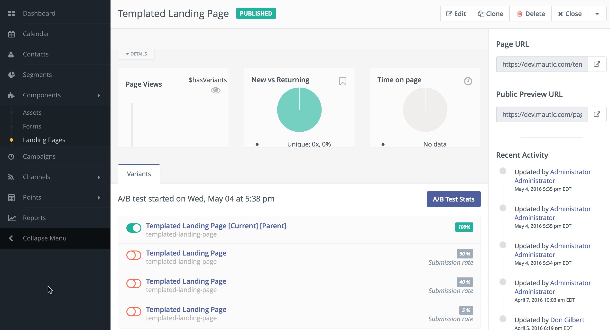
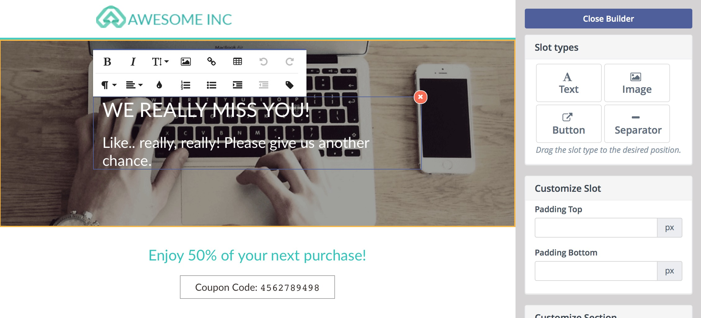
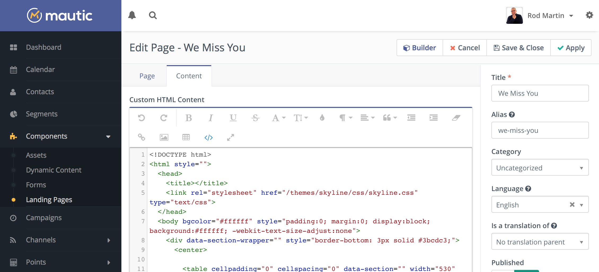

# Manage Pages

### Page Details

When viewing a page within Mautic you can find a tremendous amount of information on a single page overview.

You can see the page description at the top below the page title. Quickly see charts with the page views, new vs. returning visitors, and the average time on page. These charts are updated in real-time based on traffic.

On the right you will find a link which you can use to preview the page and a list of recent activities that are related to the page.

Notice when viewing the page details you can select the Details tab located just below the description to expand the area and see more specific details.

### Translations and Variants

As mentioned previously when viewing the page details you can also view the various translations and page variants which have been created. These variations are also useful when performing A/B testing.

When creating/editing a landing page, there are the options to configure a language and translation parent. By selecting a translation parent, the current item is then considered to be a translation in the selected language of that parent item. 

If the contact has a preferred locale or browser set in an available translation, and that translation exists, the translated landing page will automatically display for that contact. A contact's preferred locale is automatically gleaned from the browser's settings but can be overridden by editing the contact's preferred locale profile field.

It is also possible to have translations of A/B test variants.

### New/Edit Pages

The page form allows you to create new pages and offers a number of fields for your convenience. You will notice most of them in the following screenshot.  In particular you will notice the Page Builder button on the top toolbar. This is where you will launch the page builder to easily create your page layouts.

Every part of the template is editable via drag and drop.  Click in a text box to edit.  Click on an image to replace.  Once you're happy, just click "Close Builder" and you'll see a representation of the page.

You can fine tune any aspect of the page via the Content tab and Source Code view.  You can even paste your own HTML inside.

You are also able to define a template to use with your page as well as the language of your page. Notice the convenience field where you can define the parent page as well. This allows you to link pages.

The page builder provides quick and convenient access to assets, other landing pages, and forms. All those are accessible via tokens in format `{component=item}`, for example `{form=4}`. A drop-down with options will appear when you type `{` character and you can search for the right token by typing its name. For example if you type `{for`, it will suggest the right token for a form which has "for" in its name and you can select it via keyboard or by clicking on it.

Since Mautic 2.7.0, the builder will let you drag the predefined content sections from the right hand toolbar and drop them to the position you choose. It's possible to select from layout of 1, 2 or 3 columns. The existing sections can be re-ordered or removed.

#### Code Mode

[Go to the Code Mode docs](./../themes/code_mode.html).

### Unpublish a page

The pages can be unpublished and published again with a click of a button or by setting publish/unpublish date in the page configuration. Unpublishing a page means that contacts will see the 404 message (page not found) instead of the page itself.

#### Redirect when a page is unpublished

Mautic allows you to configure a 301 (permanent) or a 302 (temporary) redirect. The redirects will work if the page is unpublished.

Note: When you are logged in as a Mautic administrator, you will always see the page content even though it is unpublished. But if you log out of Mautic or open the page in an incognito window to emulate access of a normal contact, you will be able to see the 404 message or the redirect if configured.

#### Disable search indexing

Mautic 2.13 added new option [Block search indexing with noindex](https://support.google.com/webmasters/answer/93710?hl=en). You can prevent a page from appearing in search engines like Google, Bing etc.