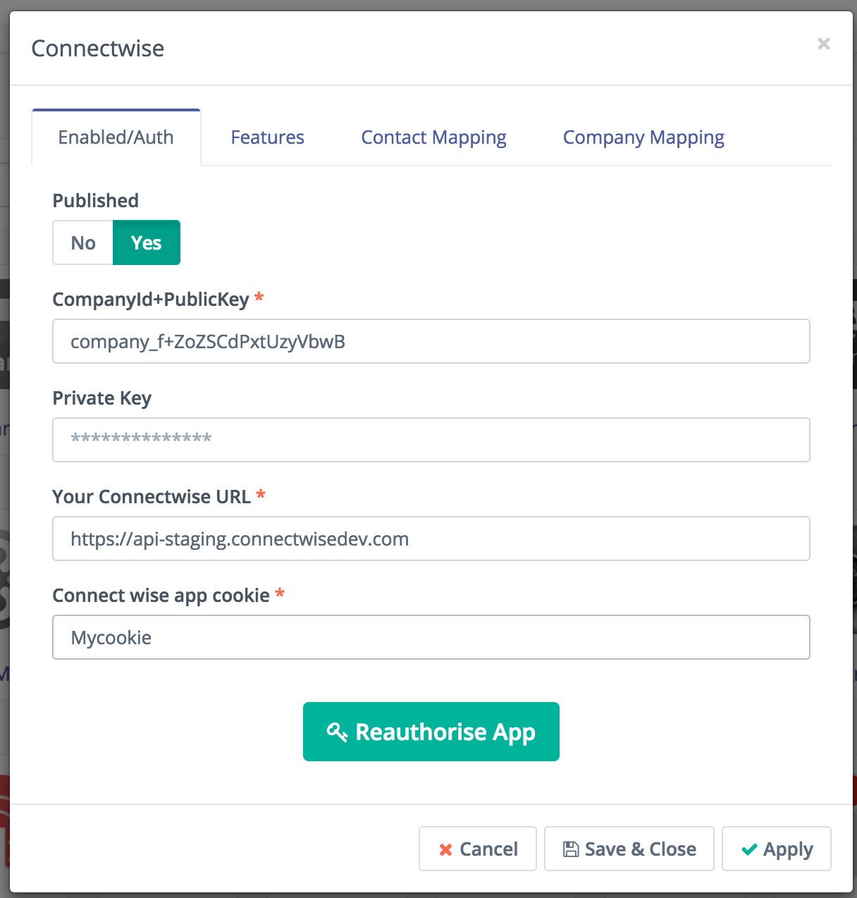
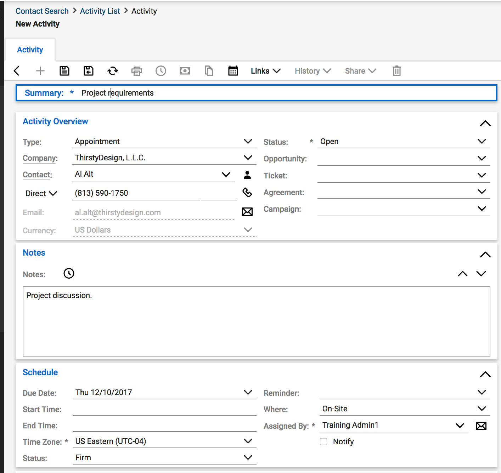
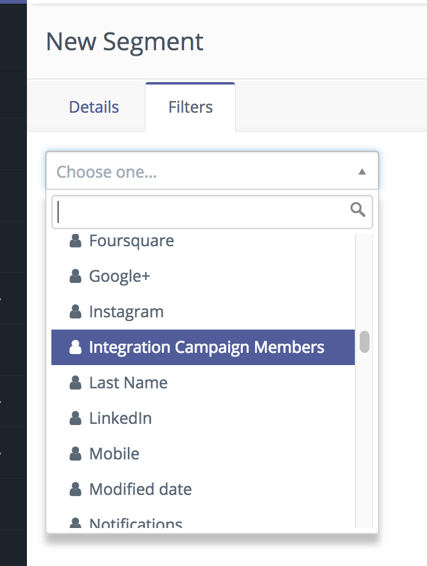

# Mautic - Connectwise CRM plugin

This plugin can push/pull a contact to/from Connectwise Manage.

## Requirements

- A Connectwise Manage account.
- Connectwise company id
- Connectwise api member with administrative role

## Configure the Mautic Connectwise plugin

### Authorize App

You will need your company id in order to authenticate the Connectwise plugin.

Use the thick client to create a new API member.  Dowload think client from [here](https://university.connectwise.com/university/pageview.aspx?short_name=workstation-installation). 

1. Go to *System/member*
1. Create a new API member.

   You will also have a link to get your public and private keys.

1. Copy the public and private keys.

1. Insert the keys to the Mautic Connectwise plugin and authorize it.


1. Configure the [field mapping][field mapping].

Please map all fields marked in red, as these are required fields.

### Features

#### Enabled features

- You can pull leads and/or push leads from and to the integration.
- Push leads is done through a Form action or a Campaign action.
- Pull leads is done through command line and it can be setup as a [cron job][cron].

#### Feature specific settings

- Select the objects you wish to pull or push records from. You can push contacts to the Contacts modules in connectwise.

- Pulling records will be done from Contacts module in Connectwise to Contacts in Mautic and Companies from Connectwise will be pulled into Mautic companies.

### Command to push/pull records from Connectwise

To push or pull records from Connectwise you need to run the Mautic integration commands:

#### Pull records from the Leads object in Connectwise

```console
php app/console mautic:integration:synccontacts --integration=Connectwise
```

`mautic:integration:fetchleads` is a alias of this command.

#### Push activities to the Connectwise custom object described below

```console
php app/console mautic:integration:pushactivity --integration=Connectwise
```

`mautic:integration:pushleadactivity` is a alias of this command.

#### Usage

Both commands take these parameters:

```console
Usage:
  mautic:integration:pushactivity [options]
  mautic:integration:synccontacts [options]

Options:
  -i, --integration=INTEGRATION        Integration name. Integration must be enabled and authorised.
  -d, --start-date=START-DATE          Set start date for updated values.
  -t, --end-date=END-DATE              Set end date for updated values.
  -a, --time-interval[=TIME-INTERVAL]  Send time interval to check updates on Connectwise, it should be
                                       a correct php formatted time interval in the past eg:(-10 minutes)
```

**`--time-interval`** This parameter is used to setup the amount of time we want to pull records from. Possible entries: "-10 days", "-1 day", "-10 minutes", "-1 minute".  Maximum time interval "-29 days".

## Test the plugin

Follow [these steps](./../plugins/integration_test.html) to test the integration.

## Connectwise Contact Activities



You can create new contact activities in Connectwise through a Campaign action. To do so follow these steps.

1. Create a new campaign or use an existing one.
1. Use a push to integration action and select Connectwise. You should see the option to push activites.
1. Select No if you only wish to push campaign contacts to your Connectwise integration.
1. Select Yes and fill in required fields if you wish to push contacts and ativities related to each campaign contact. Activity name and member owner are required fields.


### In Mautic Segments

You can create a Mautic Segment composed of contacts that are in a Connectwise campaign group. To do this create a segment filter _**Integration Campaign Member**_ option, then in the filter properties select the name of the campaign group you wish to get group members from.
 
 

[mautic]: <https://mautic.org>
[Mautic]: <https://mautic.org>

[field mapping]: <field_mapping.html>
[testing]: <integration_test.html>
[points]: <./../points>
[custom field]: <./../contacts/manage_fields.html>
[cron]: <./../setup/cron_jobs.html>

[release-2.15.0]: <https://github.com/mautic/mautic/releases/tag/2.15.0>
