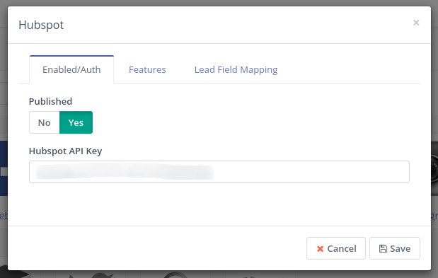

# Mautic - Hubspot CRM plugin

[Mautic] can push contacts to [Hubspot CRM] based on [Contact actions][testing] or [Point Triggers][points].

> **Note**
>
> In this document, there may be references to outdated terminology such as
>
> - _leads_,
> - _lists_ or _lead lists_, and
> - _anonymous leads_
>
> In [Mautic version `1.4`][release-1.4.0],
>
> - _leads_ were renamed to _**contacts**_
> - _lead lists_ were renamed to _**segments**_
> - _anonymous leads_ were renamed to _**visitors**_

[release-1.4.0]: <https://github.com/mautic/mautic/releases/tag/1.4.0>

## Hubspot API key

Visit [https://app.hubspot.com/hapikeys][hubspot-keys] to generate your [Hubspot API key][hubspot-keys].

## Configure the Hubspot CRM plugin

1. Create a [Hubspot CRM] account if you don't have one already.

1. Open the Hubspot Plugin configuration

   - Paste the [API key][hubspot-keys] into the *Hubspot API key* input field.

   - If you want to use the plugin, set the *Publish* switch to *Yes*.
    

1. In the _Features_ tab select *Push contacts to this integration* checkbox.

    It is checked by default. If you uncheck it, the plugin will not push contacts to [Hubspot CRM] any more.

1. Configure the [field mapping][field mapping].

1. Save the plugin configuration.

## Test the plugin

Follow [these steps][testing] to test the integration.

## Troubleshooting

If the contact has not been created, ensure the email address you tested with is valid. Hubspot will only create a new contact when the email address is valid.

## Credit

This plugin had been developed by [@gpassarelli].

[Hubspot CRM]: <https://www.hubspot.com/crm>
[hubspot-keys]: <https://app.hubspot.com/hapikey>

[@gpassarelli]: <https://github.com/gpassarelli>

[mautic]: <https://mautic.org>
[Mautic]: <https://mautic.org>

[field mapping]: <field_mapping.html>
[testing]: <integration_test.html>
[points]: <./../points>
