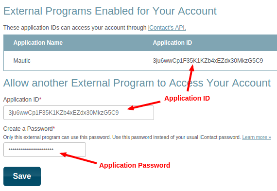
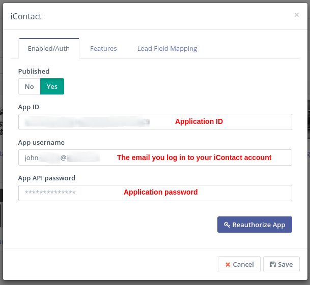

# iContact integration

[Mautic] can push contacts to [iContact] based on [Contact actions][testing] or [Point Triggers][points].

> **Note**
>
> In this document, there may be references to outdated terminology such as
>
> - _leads_,
> - _lists_ or _lead lists_, and
> - _anonymous leads_
>
> In [Mautic version `1.4`][release-1.4.0],
>
> - _leads_ were renamed to _**contacts**_
> - _lead lists_ were renamed to _**segments**_
> - _anonymous leads_ were renamed to _**visitors**_

[release-1.4.0]: <https://github.com/mautic/mautic/releases/tag/1.4.0>

## Authorize

In order to connect your [iContact] account with [Mautic], you'll have to create an [iContact APP].

Follow the [tutorial][iContact APP] to create your [iContact APP].

When you have your [APP][iContact APP] created, you should be able to see this screen:

## Configure the plugin

1. Fill in the new credentials for [Mautic] - [iContact] integration:

   - APP ID = the Application ID you created
   - APP username = the email you use to log into your [iContact] account. (Not the APP name)
   - APP password = The password chosen when saving the [APP][iContact APP].

    

1. Navigate to the *Features* tab in the plugin configuration modal box.

   1. Select the _iContact_ Segment where the Mautic Contacts should be pushed into.

      There should be one Segment created by default.

   1. In the _Features_ tab select *Push contacts to this integration* checkbox.

    It is checked by default. If you uncheck it, the plugin will not push contacts to [iContact] any more.

1. Configure the [field mapping][field mapping].

1. Save the plugin configuration.

## Test the plugin

Follow [these steps][testing] to test the integration.

[iContact]: <https://www.icontact.com>
[iContact APP]: <https://www.icontact.com/developerportal/documentation/register-your-app/>

[mautic]: <https://mautic.org>
[Mautic]: <https://mautic.org>

[field mapping]: <field_mapping.html>
[testing]: <integration_test.html>
[points]: <./../points>
