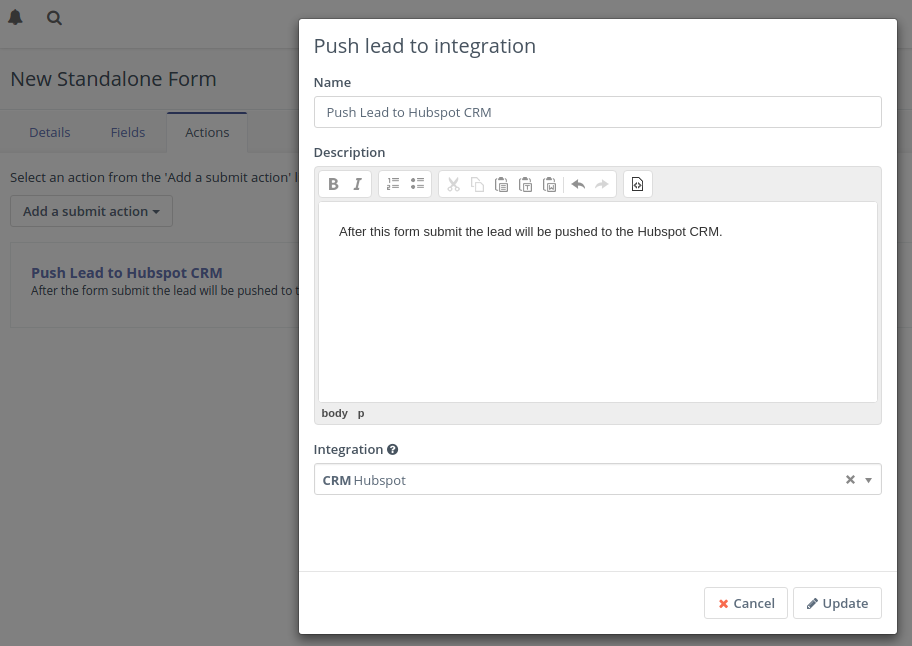
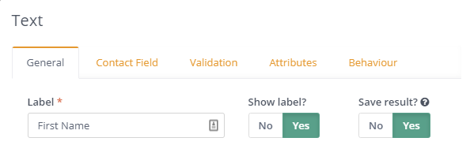
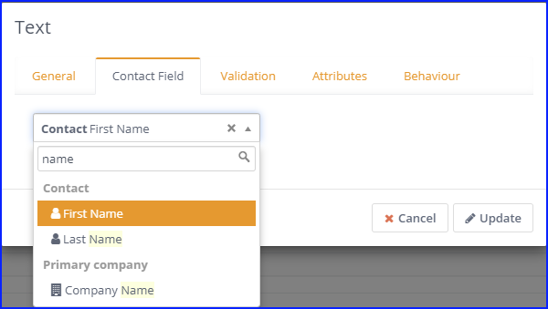

## How to test an integration

If you want to test an integration plugin to ensure that it is configured properly, you have three options how to do that. A contact can be pushed to an integration via these actions:

- The **Campaign Builder** has the _Push contact to integration_ action which can be used in the Campaign configuration.
- The **Standalone Form** has the _Push contact to integration_ action which can be used after a standalone form is submitted.
- The **Points Trigger** has the _Push contact to integration_ action which can be triggered when a contact achieves a configured point limit.

Use any of those actions to test the plugin and see if the contact appears in the integration. Here is an example of how the Standalone Form action can be configured:

1. Create a form with some fields

    (e.g. an _`email`_ and a _`firstname`_ field)

1. Add the _Push contact to integration_ action

    (e.g. Hubspot CRM)

1. Browse to the form's public URL

    `https://example.com/form/[formID]`

1. Fill in the fields with sample contact information and submit
1. Check the integration to see if the new contact was created

### Troubleshooting

If the _`firstname`_ value was not saved to the integration:

1. In the Form _General_ configuration tab, confirm that the Form is configured to **`Save result`**.
    

1. In the Form _Contact Field_ configuration tab, confirm the field is:

    **`Contact`**` First Name`
    

1. Double check the Integration field mappings
