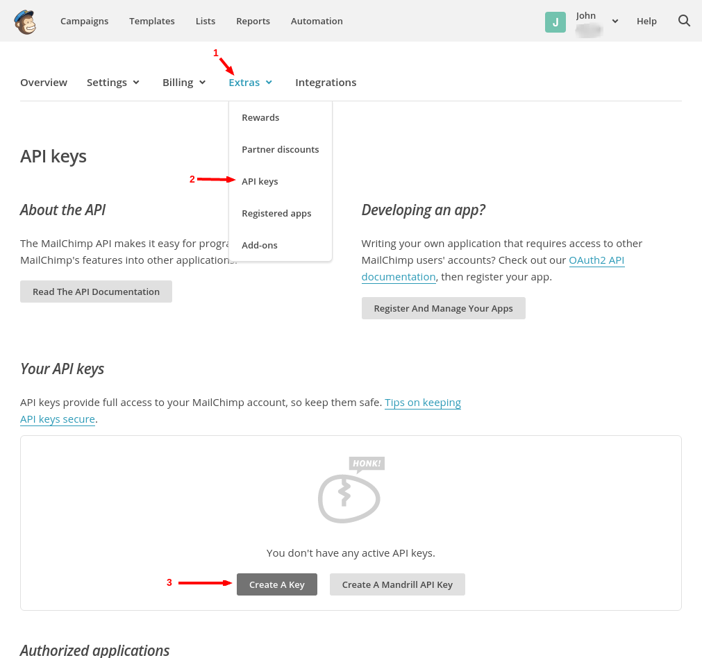
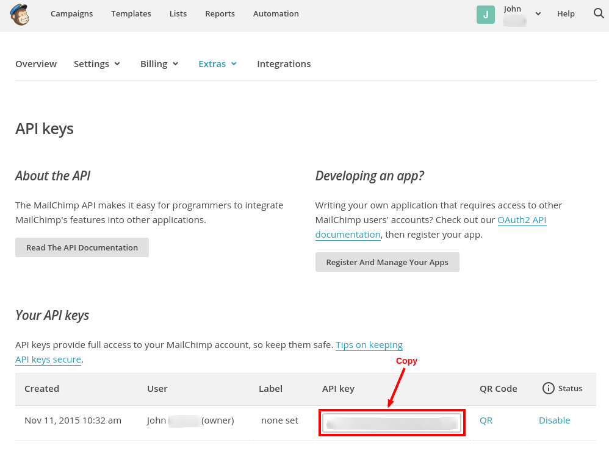
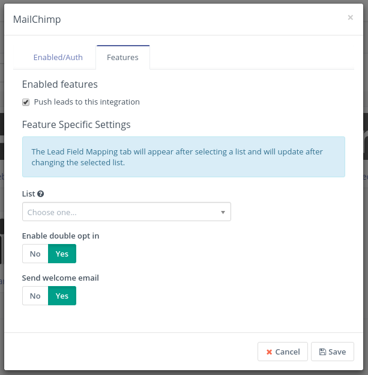

# MailChimp integration

[Mautic] can send Contacts to [MailChimp] based on [Contact actions][testing] or [Point Triggers][points].

## Version notes

- For [Mautic 1.2.3][release-1.2.3] and [later][release-latest], the authentication is based on the API key.

  This is covered in this document.

- For [Mautic 1.2.2][release-1.2.2] and older
  - a MailChimp app has to be created
  - the authentication is made via oAuth2
  - Client key and secret credentials are needed for authentication
  - SSL (https) connection is required

This plugin is backward compatible.

- If the client ID is filled, the plugin will use oAuth2.
- If the client ID is empty, the plugin will let you insert the API key.

> **Note**
>
> In this document, there may be references to outdated terminology such as
>
> - _leads_,
> - _lists_ or _lead lists_, and
> - _anonymous leads_
>
> In [Mautic version `1.4`][release-1.4.0],
>
> - _leads_ were renamed to _**contacts**_
> - _lead lists_ were renamed to _**segments**_
> - _anonymous leads_ were renamed to _**visitors**_

[release-1.4.0]: <https://github.com/mautic/mautic/releases/tag/1.4.0>

## Authorize

### Get MailChimp API key

1. Create a [MailChimp] account if you don't have one already.
2. Go to *Account* / *Extras* / *API Keys* and create a new one.
3. Copy the created API Key.

### Authorize Mautic - MailChimp plugin

Fill in the **username** you use to log in to MailChimp and the **API key**. Save the plugin.

## Configure the plugin

Navigate to the *Features* tab in the plugin configuration modal box. You should see this note:

> The Contact Field Mapping tab will appear after selecting a segment and will update after changing the selected segment.

1. Select the Segment.

   If you don't have a segment in [MailChimp] created yet, go to *MailChimp dashboard* / *Segments* / *Create List* and create one.

1. Save the plugin configuration
1. Open it again.

   The *Contact Field Mapping* tab should appear now.

1. Configure the [field mapping].

### Other configuration options

- **Push contacts to this integration**

   This option is checked by default. If you uncheck it, the plugin will not push contacts to MailChimp any more.

- **Enable double opt in** - If MailChimp should send a confirmation email to the contacts added by this plugin. The contacts will have to confirm that they really want to be added to the segment.
- **Send welcome email** - Whether MailChimp should send the welcome email.

## Test the plugin

Follow [these steps][testing] to test the integration.

[mautic]: <https://mautic.org>
[Mautic]: <https://mautic.org>
[MailChimp]: <https://mailchimp.com>

[field mapping]: <field_mapping.html>
[testing]: <integration_test.html>
[points]: <./../points>

[release-latest]: <https://github.com/mautic/mautic/releases/latest>
[release-1.2.3]: <https://github.com/mautic/mautic/releases/tag/1.2.3>
[release-1.2.2]: <https://github.com/mautic/mautic/releases/tag/1.2.2>
