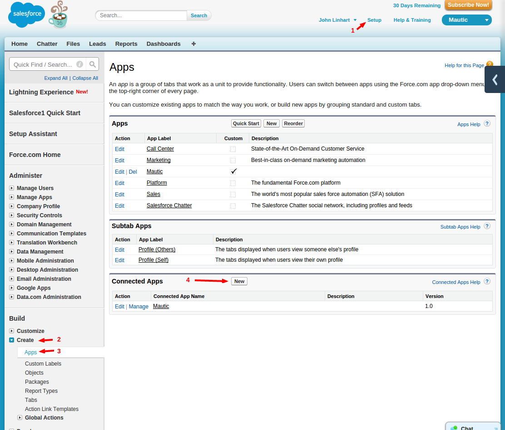
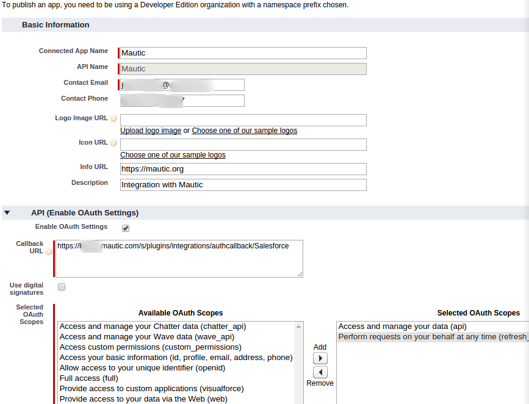
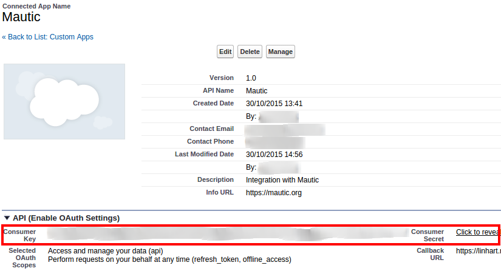
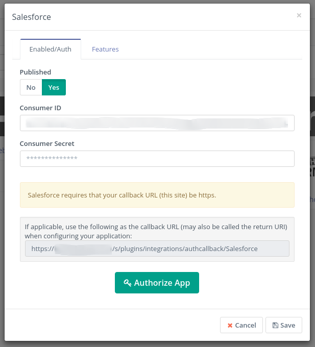
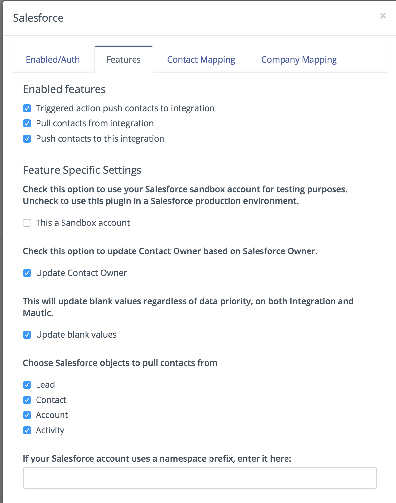
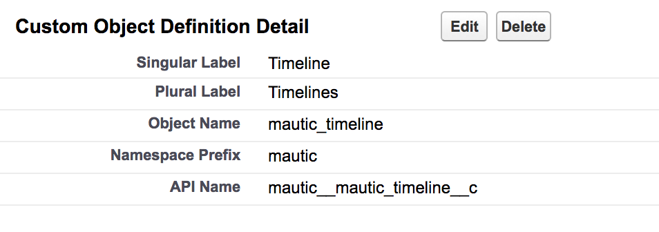
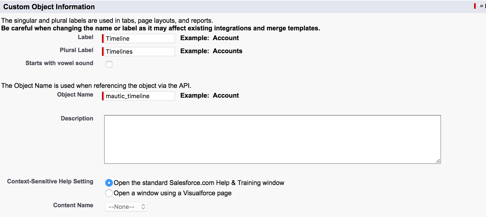
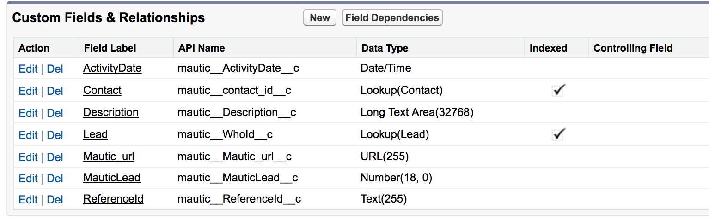
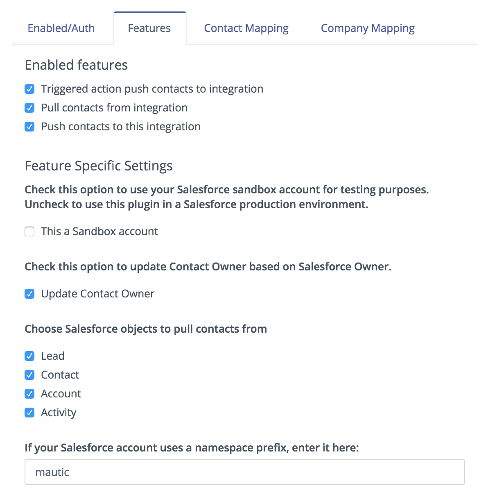
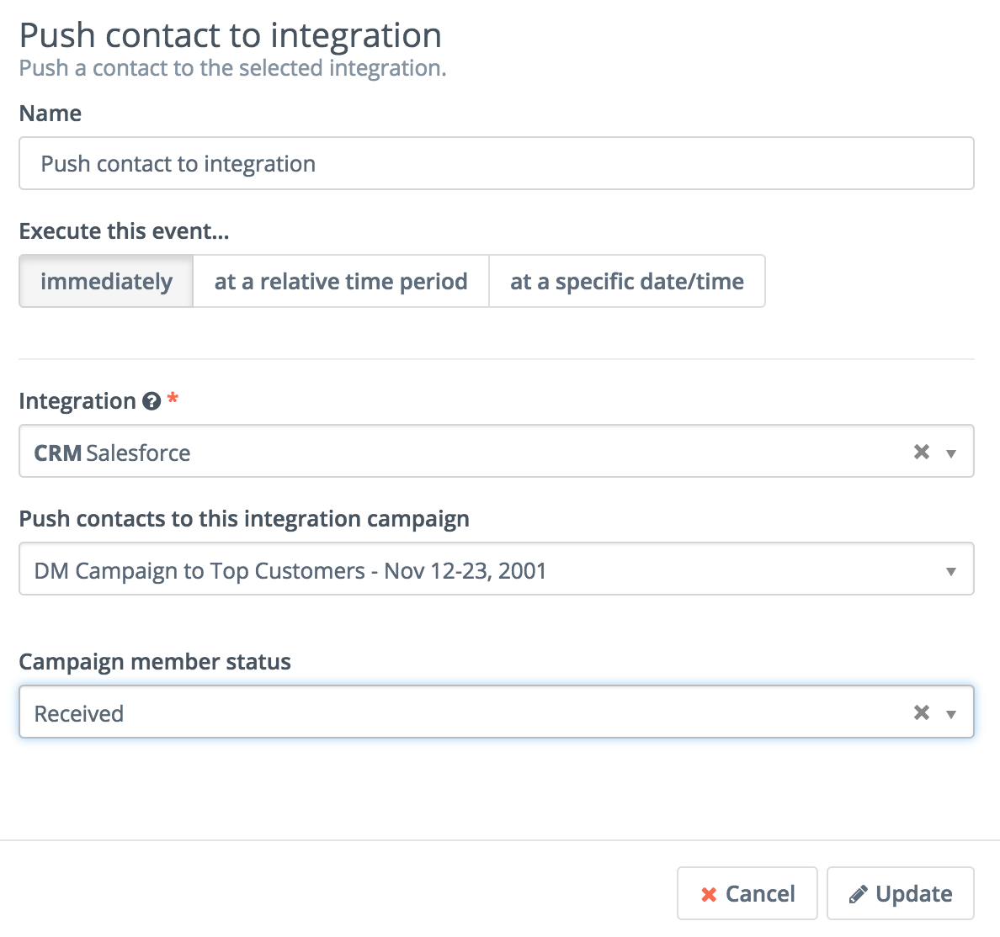

# Mautic - Salesforce CRM plugin

[Mautic] can push a contact to [Salesforce CRM] based on [Contact actions][testing] or [Point Triggers][points].

> **Note**
>
> In this document, there may be references to outdated terminology such as
>
> - _leads_,
> - _lists_ or _lead lists_, and
> - _anonymous leads_
>
> In [Mautic version `1.4`][release-1.4.0],
>
> - _leads_ were renamed to _**contacts**_
> - _lead lists_ were renamed to _**segments**_
> - _anonymous leads_ were renamed to _**visitors**_

[release-1.4.0]: <https://github.com/mautic/mautic/releases/tag/1.4.0>

## Requirements

1. Create a [Salesforce CRM] account if you don't have one already.
1. Your [Mautic] instance has to run on `https://`.

    Salesforce will not allow you to create an App with a `http://` callback URL.

## Configure the Mautic Salesforce plugin

### Authorize App

There is [official documentation](http://feedback.uservoice.com/knowledgebase/articles/235661-get-your-key-and-secret-from-salesforce) about how to get the _Consumer Key_ and _Consumer Secret_ although it doesn't seem to be updated.

Follow these steps to get the Salesforce _Consumer_ credentials

1. Click on _Setup_ (top right corner)
   - Scroll down to _Build_ in bottom left corner
1. _Create_
1. _Apps_
   - Scroll down to _Connected Apps_
1. Click _New_


1. Create a new app like this:

    | Field | Value |
    | ----: | :---- |
    | Connected App Name | Mautic |
    | API Name | Mautic |
    | Contact Email | your Salesforce account email |
    | Description | Integration with Mautic |
    | Enable OAuth Settings | `<ticked>` |
    | Callback URL (in [Mautic version 2.15][release-2.15.0]) | <https://example.com/plugins/integrations/authcallback/Salesforce> |
    | Selected OAuth Scopes | _Access and manage your data (api)_, _Perform requests on your behalf at any time (refresh_token, offline_access)_ |
    
    Make sure the Selected OAuth Scopes are *Access and manage your data (api)* and *Perform requests on your behalf at any time (refresh_token, offline_access)*.

1. Copy the Consumer Key and Secret.


1. Insert the credentials from the Salesforce App into the Mautic Salesforce plugin and _Authorize App_.

    _Consumer ID_ is the _Consumer Key_
    

1. Configure the [field mapping][field mapping].

    - Formula fields from Salesforce will be pulled and can be saved into a Mautic [custom field].
    - Salesforce's lead Id can be matched to a Mautic [custom field].

### Features

#### Enabled features

- You can pull leads and/or push leads from and to the integration.
- Push leads is done through a Form action or a Campaign action.
- Pull leads is done through command line and it can be setup as a [cron job][cron].



#### Feature specific settings

- Sandbox - when using a sandbox account to test, Mautic will use the test URL for the API provided by Salesforce.

- Updating of a Contact's Owner can be be enabled by turning on *Update Contact Owner*. This is not enabled by default. In order for a Contact in Mautic to match a User in Salesforce the email addresses in the two systems must be identical.

- If _Update blank values_ is checked
  - When pulling contacts from Salesfoce: it will check for fields mapped fields in Mautic and it will update these fields with Salesforce data regardless of the arrow direction set in the configuration.
  - When pushing data to Salesforce it will check for blank mapped fields in Salesforce and it will update these with Mautic's data regardless of the directions of the arrows setup in the configuration.
- Select the objects you wish to pull or push records from.

  - You can push Mautic Contacts to the Lead and Contact object in Salesforce.
  - You can push activities (Contact's timeline records) to a custom object in Salesforce.
  - Pulling records will be done from Leads and/or Contacts objects into Contacts in Mautic and _Accounts_ from Salesforce will be pulled into Mautic _Companies_.

### Command to push/pull records from Salesforce

To push or pull records from Salesforce you need to run the Mautic integration commands:

#### Pull records from the Leads object in Salesforce

```console
php app/console mautic:integration:synccontacts --integration=Salesforce
```

`mautic:integration:fetchleads` is a alias of this command.

#### Push activities to the Salesforce custom object described below

```console
php app/console mautic:integration:pushactivity --integration=Salesforce
```

`mautic:integration:pushleadactivity` is a alias of this command.

#### Usage

Both commands take these parameters:

```console
Usage:
  mautic:integration:pushactivity [options]
  mautic:integration:synccontacts [options]

Options:
  -i, --integration=INTEGRATION        Integration name. Integration must be enabled and authorised.
  -d, --start-date=START-DATE          Set start date for updated values.
  -t, --end-date=END-DATE              Set end date for updated values.
  -a, --time-interval[=TIME-INTERVAL]  Send time interval to check updates on Salesforce, it should be
                                       a correct php formatted time interval in the past eg:(-10 minutes)
```

**`--time-interval`** This parameter is used to setup the amount of time we want to pull records from. Possible entries: "-10 days", "-1 day", "-10 minutes", "-1 minute".  Maximum time interval "-29 days".

## Setting up Mautic's Custom Object in Salesforce

To be able to push **Contact timeline** activities to the Salesforce integration you need to setup a Custom Object in Salesforce, as described below.

We will describe the name of the fields and object that result after completing the process of creating the Custom Object.

In this example, Salesforce has given the Custom Object a _namespace name_ of **`mautic__`**. (Note: there are two underscores with no space between).

Use the text in bold when creating your custom fields.

### Custom Object Information

| Field | Value |
| :---- | :---- |
| Custom Object name | (namespace)**mautic_timeline** |
| Label | Timeline |
| Plural Label | Timelines |
| Object name | **mautic_timeline** |
| Namespace Prefix | mautic (no underscores) |
| API name | (namespace)**mautic_timeline**__c |




### Custom Fields & Relationships

API names of fields:

> `ReferenceId` must be set as a unique field in Salesforce to prevent duplicating activity entries

| Field Label | API Name | Data Type | Indexed |
| :---------- | :------- | :-------- | :-----: |
| ActivityDate | (namespace)**ActivityDate**\\__c | Date/Time | . |
| Contact      | (namespace)**contact_id**\\__c  | Lookup(Contact) | x |
| Description  | (namespace)**Description**\\__c | Long Text Area(131072) | . |
| Lead         | (namespace)**WhoId**\\__c       | Lookup(Lead) | x |
| Mautic_url   | (namespace)**Mautic_url**\\__c  | URL(255) | . |
| MauticLead   | (namespace)**MauticLead**\\__c  | Number(18, 0) (External ID) | . |
| ReferenceId  | (namespace)**ReferenceId**\\__c | Text(255) | . |



When enabling the activity object, you need to tick the Activity checkbox in the Mautic plugin configuration and also specify the namespace prefix if it's available in Salesforce


You can filter what contact timeline activities to push to your custom object in Salesforce using the **Events to include in the activity sync** selector. If this is left blank all activity types will be pushed to your activity object in Salesforce.


## Salesforce Campaigns and Mautic

Mautic can communicate with Salesforce campaigns through trigger actions in Mautic Campaigns and Forms, and through Mautic Segments.

### In Mautic Campaigns

In a campaign you can Push contacts to Salesforce integration, to a specific campaign.  From the configuration window you can select the campaign and the status you wish your campaign members to have when inserted to the Salesforce campaign.

Follow similar procedure for a Form action to push to Salesforce integration.


### In Mautic Segments

You can create a Mautic Segments composed of Contacts that are in a Salesforce campaign. To do this create a segment filter _**Integration Campaign Member**_ option, then in the filter properties select the name of the campaign you wish to get campaign members from.


## Syncing Salesforce Email Opt Out with Mautic Do Not Contact

### Prepare Salesforce

In Salesforce, make sure the _Email Opt Out_ field is visible to edit and that field history tracking has been set for the _Email Opt Out_ field.

a. Under the Setup menu, go to Build -> Customize then do the following for each of Lead and Contact's layouts

   

a. Add the Email Opt Out field

   

a. Continue by going to the customise fields

   

a. Select the _Email Opt Out_ field and edit the field level security option

   

   

a. Check to see if the field is visible at all levels. If not, select it and save.

   

   

a. Setup Field History by going to Setup->Customize->Leads->Fields menu (and also the Contacts fields menu) and _Set History Tracking_ on the _Email Opt Out_ fields

   

   

### Prepare Mautic

1. In Mautic's configuration for the Salesforce integration, on the _Features_ tab, check the box to `Use latest updated Do Not Contact record`
2. Map the Salesforce `Email Opt Out` field to Mautic's `Do Not Contact by email` field
3. Now the Do Not Contact status will update to the integration

## Test the plugin

Follow [these steps][testing] to test the integration.

## Troubleshooting

### Error: `The REST API is not enabled for this Organization.`

This means the API is not turned on in your Salesforce account. [Read more][salesforce-admin]


[Salesforce CRM]: <https://www.salesforce.com/>
[salesforce-admin]: <https://help.salesforce.com/apex/HTViewHelpDoc?id=admin_userperms.htm&language=en>

[mautic]: <https://mautic.org>
[Mautic]: <https://mautic.org>

[field mapping]: <field_mapping.html>
[testing]: <integration_test.html>
[points]: <./../points>
[custom field]: <./../contacts/manage_fields.html>
[cron]: <./../setup/cron_jobs.html>

[release-2.15.0]: <https://github.com/mautic/mautic/releases/tag/2.15.0>
