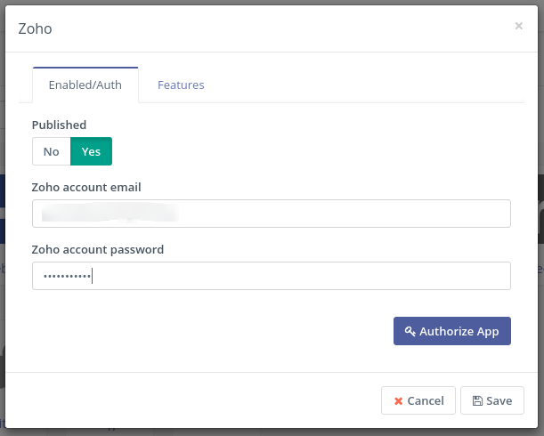

# Mautic - Zoho CRM plugin

[Mautic] can push a contact to [Zoho CRM] based on [Contact actions][testing] or [Point Triggers][points].

## Language configuration warning

> **Warning**
>
> Your [Zoho][zoho-admin] and [Mautic] accounts must be **configured for English language**, otherwise the synchronization won't work.
>
> Zoho changes the alias of each of the contact fields depending on the language, which generates unmatched fields and errors on sync.

## Configure the Zoho CRM plugin

1. Create a [Zoho CRM] account if you don't have one already.

1. Insert the email and password you created the Zoho account with into the Mautic Zoho integration plugin and Authorize it.

    If Zoho [Two Factor Authentication][zoho-admin] is enabled, an [Application Specific Password][zoho-admin] will need to be generated and used.

1. Set the *Publish* switch to *Yes*. Save.

1. In the _Features_ tab select *Push contacts to this integration* checkbox.

    It is checked by default. If you uncheck it, the plugin will not push contacts to [Zoho CRM] any more.

1. Configure the [field mapping][field mapping].

1. Save the plugin configuration.

## Test the plugin

Follow [these steps][testing] to test the integration.

[Zoho CRM]: <https://www.zoho.com/crm/>
[zoho-admin]: <https://www.zoho.com/mail/help/adminconsole/two-factor-authentication.html#alink5>

[mautic]: <https://mautic.org>
[Mautic]: <https://mautic.org>

[field mapping]: <field_mapping.html>
[testing]: <integration_test.html>
[points]: <./../points>
