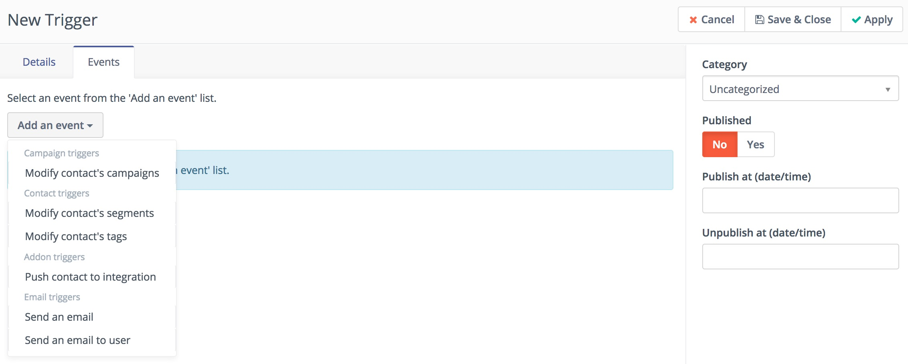
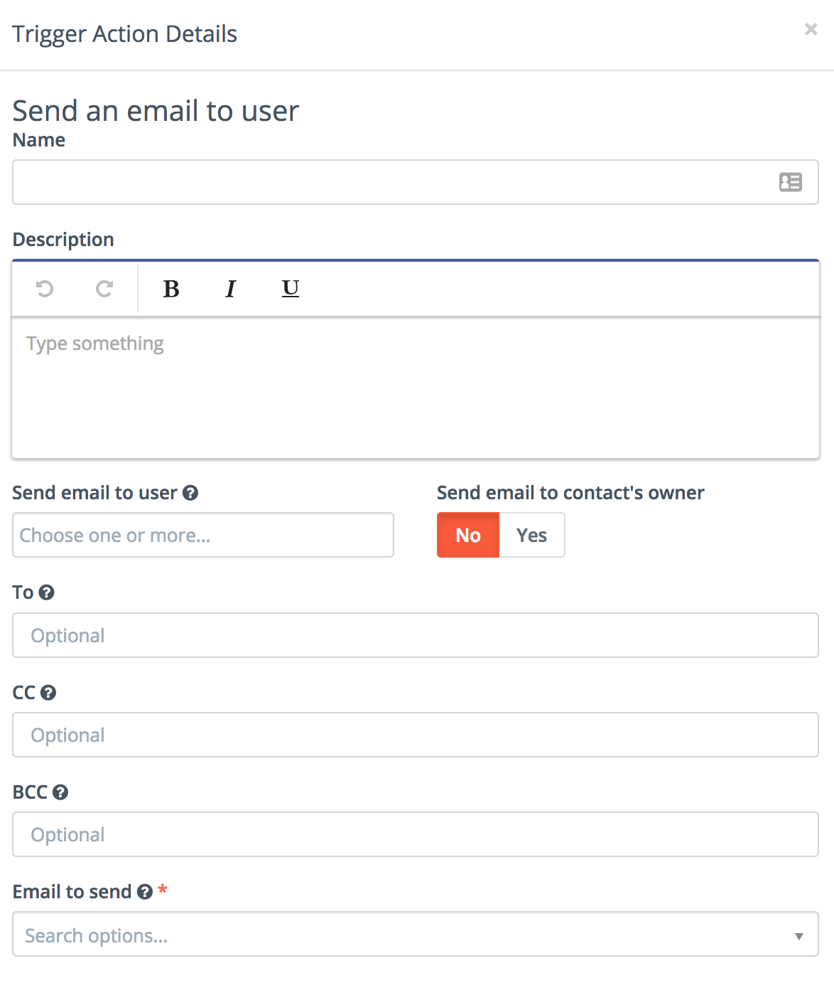

# Points

Points provide a way for contacts to be properly weighted. These points have both triggers and actions. Each term will be properly defined and a thorough understanding of how points function will ensure that your overall marketing automation process is successful.

### Point Actions

Point actions are those times when a contact receives a change in their point total. These actions can be either positive or negative point changes and are based on a particular action as you determine.

A partial list can be seen in the screenshot below.

Clearly these actions can be expanded upon as needed. This is the essence of point actions. The other part of the points system are the triggers. They are defined next.

### Point Triggers

Point triggers are resulting events which are fired based on the achieved point total of a contact. In simple terms, when a contact reaches a minimum number of points, the point trigger is fired and an action is performed.

When creating a point trigger you have the option to apply the trigger to all existing and applicable contacts as well as new contacts.

These point triggers and associated events are also fully customizable.

### Send an email to user

This event lets you send an email to any user or any email address:

* If you select an user and check "send email to contact's owner" option, both contact will be notified.
* If user has no owner or owner is same as user, only one email will be send.
* You can add more emails to "to", "cc" and "bcc" fields - separate emails with coma (,). You can add space after each coma too.
* Notification will be send to all address - user's email, owner's email, to, cc and bcc.
