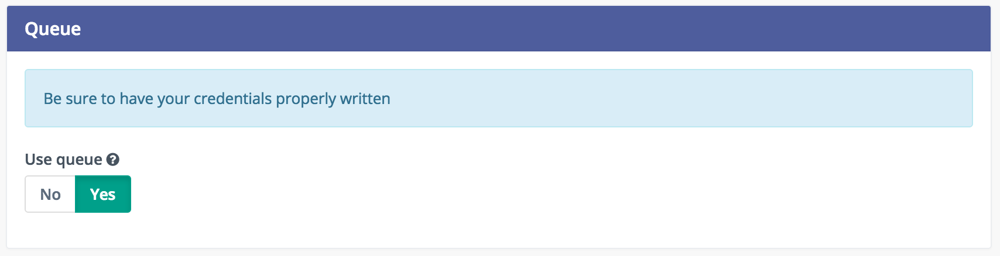

# Use queue protocol in Mautic to better handle scalability.

By using a queue protocol, we allow mautic to postpone orders.
Indeed, some HTTP requests take a long time to respond, taking memory and CPU away from your server.
Having too much of them can cause bottleneck.

Currently queue protocol is implemented for email tracking, but we hope to make it works for web pixel.

## RabbitMQ

[RabbitMQ](https://www.rabbitmq.com/features.html) is the first messaging broker to be implemented.

In order to use it, you must have a rabbitmq-server running.
If you want to test it, you can use [cloudamqp](https://www.cloudamqp.com/) which offers a RabbitMQ as a service.
But do not use it in production, as it will slow down your app if it is not located in the same datacenter ( AWS for cloudamqp ).

You can configure emails in the email section of the administration panel.



To have it works, you must set variables in the config file of the mautic Core directory :

```
 'rabbitmq_host'                  => 'localhost',
 'rabbitmq_port'                  => '5672',
 'rabbitmq_vhost'                 => '/',
 'rabbitmq_user'                  => 'guest',
 'rabbitmq_password'              => 'guest',
```

Default settings should work with local installation.

Then you can follow orders queuing in RabbitMQ admin interface.

To consume orders, use the following commands :

```
./app/console rabbitmq:consumer QUEUE_NAME
```

For email tasks, a task_email queue should be created. 

Many options are available on how to consume messages, refer to the [RabbitMqBundle](https://github.com/php-amqplib/RabbitMqBundle) which is used internally.