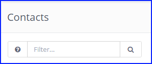

# Search operators and filters

Mautic allows you to use a range of search operators and filters to drill down into relevant resources. The available search filters and operators can be found next to the search input by clicking on the button with question mark. If such button is missing then there are no search filters available for that particular entity. Only hypertext search.

Mautic also has a "global search" feature. Click on the magnifying glass icon next to the Mautic logo/notifications icon on the top lefthand corner. It will open a search input and you can search through multiple different entities.

## Search operators

The following search operators can be used:

- `+` (plus sign) - Search for the exact string (i.e. if admin, then administrator will not match)
- `!` (exclamation mark) - Not equals string
- `" "` (double quotes) - Search by phrase
- `( )` (parentheses) - Group expressions together.
- `OR` - By default the expressions will be joined as `AND` statements. Use the `OR` operator to change that.
- `%` - Use the `%` as a wildcard to search for specific names or values in a phrase (i.e. to find all companies with the word ‘Technologies’ then type `%technologies%`)

## Search filters

The following search filters can be used:

### Contacts

    is:anonymous
    is:unowned
    is:mine
    email:*
    segment:{segment_alias}
    name:*
    company:*
    owner:*
    ip:*
    ids:ID1,ID2 (comma separated IDs, no spaces)
    common:{segment_alias} + {segment_alias} + ...
    tag:*
    stage:*
    email_sent:EMAIL_ID
    email_read:EMAIL_ID
    email_queued:EMAIL_ID
    email_pending:EMAIL_ID

### Companies

    ids:ID1,ID2 (comma separated IDs, no spaces)
    is:published
    is:unpublished
    is:mine
    is:uncategorized
    category:{category alias}

### Segments

    ids:ID1,ID2 (comma separated IDs, no spaces)
    is:global
    name:*

#### Assets

    ids:ID1,ID2 (comma separated IDs, no spaces)
    is:mine
    is:published
    is:unpublished
    name:*
    is:uncategorized
    category:{category alias}

### Forms

    ids:ID1,ID2 (comma separated IDs, no spaces)
    is:mine
    is:published
    is:unpublished
    has:results
    name:*
    is:uncategorized
    category:{category alias}

### Landing pages

    ids:ID1,ID2 (comma separated IDs, no spaces)
    is:published
    is:unpublished
    is:mine
    is:uncategorized
    is:prefcenter
    category:{category alias}
    lang:{lang code}

### Dynamic Content

    ids:ID1,ID2 (comma separated IDs, no spaces)
    is:published
    is:unpublished
    is:mine
    is:uncategorized
    is:prefcenter
    category:{category alias}
    lang:{lang code}

### Emails

    ids:ID1,ID2 (comma separated IDs, no spaces)
    is:published
    is:unpublished
    is:mine
    is:uncategorized
    category:{category alias}
    lang:{lang code}

### Focus items

    ids:ID1,ID2 (comma separated IDs, no spaces)
    is:published
    is:unpublished
    is:mine
    is:uncategorized
    category:{category alias}

### Manage actions

    ids:ID1,ID2 (comma separated IDs, no spaces)
    is:published
    is:unpublished
    is:mine
    is:uncategorized
    category:{category alias}

### Manage triggers

    ids:ID1,ID2 (comma separated IDs, no spaces)
    is:published
    is:unpublished
    is:mine
    is:uncategorized
    category:{category alias}

### Stages

    ids:ID1,ID2 (comma separated IDs, no spaces)
    is:published
    is:unpublished
    is:mine
    is:uncategorized
    category:{category alias}

### Reports

    ids:ID1,ID2 (comma separated IDs, no spaces)
    is:published
    is:unpublished
    is:mine

### Categories
   ids:ID1,ID2 (comma separated IDs, no spaces)
   is:published
   is:unpublished

### Users

    ids:ID1,ID2 (comma separated IDs, no spaces)
    is:admin
    is:active
    is:inactive
    email:*
    name:*
    position:*
    role:*
    username:*

### Roles

    ids:ID1,ID2 (comma separated IDs, no spaces)
    is:admin
    name:*

### Webhooks

    ids:ID1,ID2 (comma separated IDs, no spaces)
    is:published
    is:unpublished
    is:mine
    is:uncategorized
    is:prefcenter
    category:{category alias}
    lang:{lang code}
