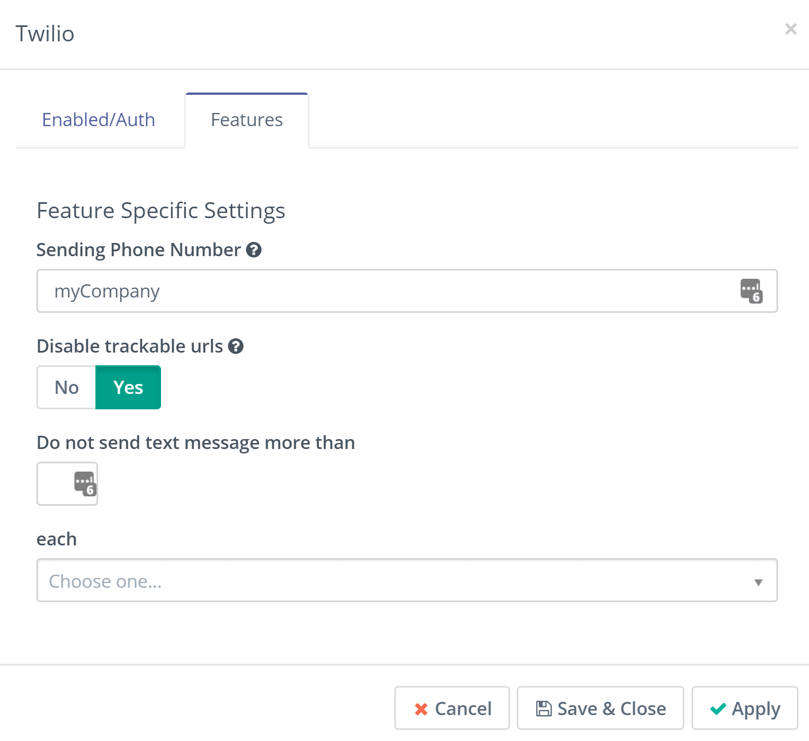

# Text Messages

This new channel was added in Mautic 1.4.0. It allows Mautic to send text messages from campaigns.

## Configure Text Messages

Before you start to send text messages from your Mautic, it needs to be connected to the service which can send them. The first and default implemented service is [Twilio](https://www.twilio.com). In order to configure the text messages correctly, follow these steps:

1. Create an account at Twilio.com.
2. In Mautic, go to *Settings* (cog icon) > *Plugins*.
3. Open *Twilio* plugin and activate it.
4. Copy the *Account SID* from Twilio account and paste it to *Account SID* field in the Twilio plugin configuration.
5. Unlock and copy the *Auth Token* and paste it to *Auth Token* field in the Twilio plugin configuration.
6. Go to *Products* > *Phone Numbers* in Twilio, copy the number and paste it to the *Sending Phone Number* field in Mautic.
7. Select the *Text Message Enabled?* switch to *Yes* and save the Mautic configuration.

## Create a new Text Message

A Text Message can be created/modified only via Campaign Builder.

1. Go to *Campaigns*.
2. Edit an existing campaign or create a new one.
3. Open the Campaign Builder.
4. Add a *Send Text Message* action to the canvas.
5. Click the *New Text Message* button. The form in a new browser window will appear.
6. Fill in the *Internal Name*, *Text Message* and if required, change the language. Save it.

The new Text message will be pre-selected so you can save the *Send Text Message* action as well. You can use the action in your Campaign dripflow.

## Alphanumeric Sender ID

Alphanumeric Sender ID allows you to send Twilio Programmable SMS messages using a personalized sender name, in supported countries (see [International Support for Alphanumeric Sender ID](https://support.twilio.com/hc/en-us/articles/223133767-International-support-for-Alphanumeric-Sender-ID)).

Instead of using an E.164 formatted Twilio Phone number for the "From" value, you can use a custom string like your own business' branding.

**Note:** Additionally, messages sent out using an **Alphanumeric Sender ID can not be replied to directly**.

####  Alphanumeric Sender ID requirements

Alphanumeric Sender ID is automatically supported on all new [upgraded (paid) Twilio accounts](https://support.twilio.com/hc/en-us/articles/223183208-Upgrading-to-a-paid-Twilio-Account). It is not supported for Free Trial accounts.

You can validate that Alphanumeric Sender is enabled on your account by following these steps:

1.  Login to your account at [www.twilio.com](http://www.twilio.com/).
2.  From the left side navigation bar, click Programmable SMS.
3.  Click Settings.
4.  Verify that "Alphanumeric Sender ID" is set to Enabled.

#### Send SMS Messages using an Alphanumeric Sender ID with Mautic

Just setup your alias in plugin settings:

Read more info about [Alphanumeric Sender ID](https://support.twilio.com/hc/en-us/articles/223181348-Getting-started-with-Alphanumeric-Sender-ID) on Twillio site.
