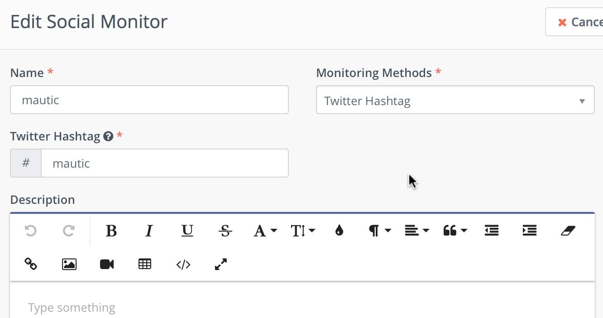
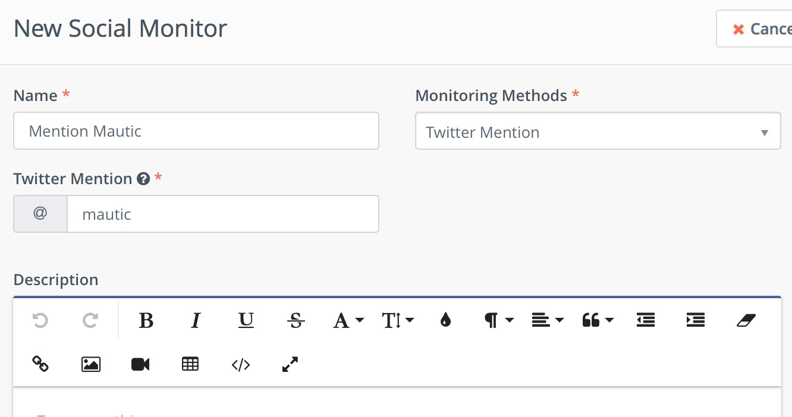

# Social Monitoring

It's possible to add contacts to Mautic through monitoring Twitter for mentions and hashtags.

## Requirements

- [Twitter plugin](../plugins/twitter.md) must be configured.
- `app/console mautic:social:monitoring` command must be triggered periodically. Add it to your [cron configuration](../setup/cron_jobs.md).

## Hashtags

Go to Channels->Social Monitoring and click New.
Select Twitter Hashtags as the Monitoring Method.
Type the hashtag you wish to monitor in the Twitter Hashtag box.
Name the monitor and click save.

## Mentions

The process is the same for Twitter mentions.

As people use the hashtag or mention that you're monitoring, you'll see them being added to your contact list.  From there you can use that information in a Campaign.
