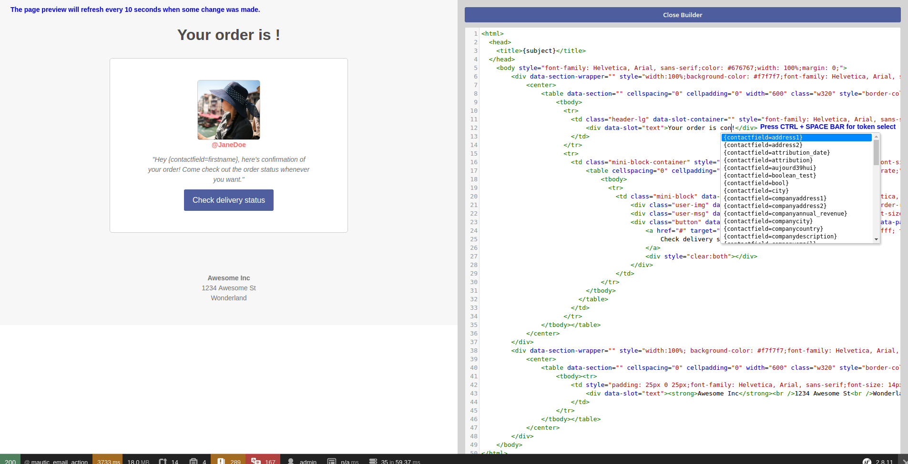

# Code Mode

Code Mode is an option available in the Email and Page edit form. It will allow you to create/insert/edit your content in HTML code. It's helpful for situations where you don't want to use a Mautic theme and you want to use an HTML theme copied from a 3rd party theme builder or if you enjoy editing HTML code so much.

Code Mode was introduced in Mautic 2.3.0 and replaced the full page Froala (WYSIWYG) editor which manipulated the HTML code in some cases. Code Mode will not modify any of the code you paste in. The other option to edit a page/email content is to use the Builder. It uses Froala editor only to edit the text/image content, not the full page, so it won't modify the page layout.

## Select the Code Mode

The Code Mode can be selected in the theme select after you create/edit the page/email. To open the Code Mode Builder after you select the Code Mode theme option, click the Builder button.

### Limitations

If you use a Mautic theme to create the page/email and you want to edit the HTML code of it in the Code Mode Builder, you can do so, but you cannot switch back to the theme again. You will always have to edit the content in the Code Mode Builder. Selecting a theme will always refresh the content to the default theme HTML and so you'll lose your modifications.

## Edit the HTML content in the Code Mode Builder

When the Code Mode Builder is opened, you can see the preview on the left, the HTML code editor on the right. The preview will automatically refresh every 10 seconds if some change has been made to the code.

### Mautic Tokens

You can use the tokens in the Code Mode Builder when you type them directly. For example when you type `{contactfield=firstname}` or you can select them from the dropdown. The dropdown will open when you press `CTRL` + `SPACE BAR`. You can type to search for the token you wish to insert.

### Media Manager

There is a button at the top of code area where you can open the Media Manager to upload and/or select an image or other file. If you select a file, the URL of that file will be inserted to the current position of the cursor. Use this to create links and IMG tags.

### Code Formatter

It might happen that your older emails or pages appear as HTML code on one line. Or if you insert an HTML code with odd formatting, use the Format Code button. It will automatically go through the code and format it so it is easier to navigate in it.
