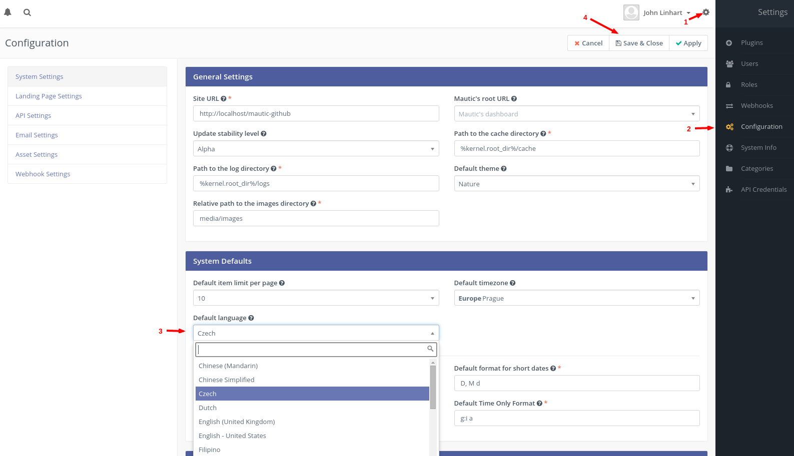
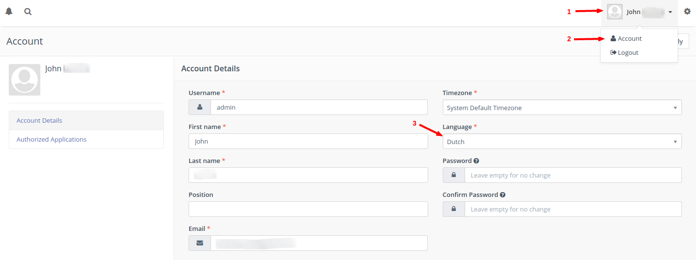

# Translations

Mautic is used by a world-wide community and therefore it can be localized to any language. If you cannot find your language yet, take a look to the section about how to translate Mautic.

## How to select a language in Mautic

Language can be selected in 2 places.

### 1. Default language

In the Mautic configuration the default language can be configured. It is pre-set to `English - United States` by default. Every user will see this language if she doesn't configure her language in her profile.

1. Open the right admin menu by clicking on the cog icon in the top right corner.
2. Select the *Configuration* menu item.
3. Select the default language.
4. Save the configuration.

### 2. User language

A user can define her own language and override the default language. This lets a multilangual team work on the same Mautic instance.

1. Open the user menu by clicking on the user name in the top right corner.
2. Click on *Account* menu item.
3. Select the user language.
4. Save the user profile.

## How to translate Mautic

Mautic can be translated to any language. As Mautic is a community project, it can be translated by any community member to any language. Translations are made in the [Transifex](https://www.transifex.com/mautic/mautic/) web app.

1. Create an account at [Transifex](https://www.transifex.com/mautic/mautic/) if you don't have one already.
2. Take a look at the [list of languages](https://www.transifex.com/mautic/mautic/) which were created for the project already.
3. Create a language if your language is missing or apply for an existing language.

Take a look at official [Transifex Documentation](http://docs.transifex.com/tutorials/txeditor/) if you have any questions about the translation process.

## How to update a language

A language is downloaded automatically every time the configuration is saved and the language hasn't been downloaded already. The tricky part is that Mautic won't download a language if it has been already downloaded. So to update a language:

1. Open the Mautic file system via SFTP or SSH.
2. In the Mautic root folder you should see the folder called *translations*. Open it.
3. In the *translations* folder are the languages stored. Remove the folder of the language you want to update.
4. Go go Mautic configuration and save it with the language you've deleted.

The language should be downloaded again with the latest translations. The translations are generated from Transifex once a day.

If you have any questions about translations, join the community in the [Slack #Translations channel](https://www.mautic.org/slack/).
