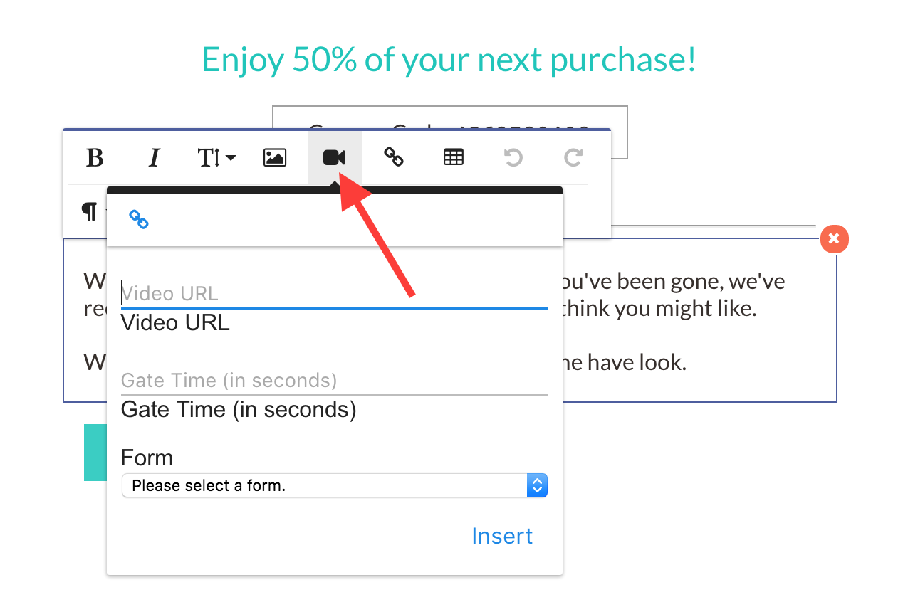

# Gated Video

This new inbound channel was added in Mautic 2.1. It allows Mautic users to embed gated
videos in their websites, landing pages, and anywhere else the mautic tracking javascript
is installed. In Mautic, a gated video is one that plays for a set amount of time then
pauses the video in order to show a form that, when submitted, will capture the lead
information then continue to play the video from where it was paused.

## Using Gated Video

Gated videos are not an entity within Mautic; they do not have a menu item. Gated videos
can be embedded in your landing page content or in your website that has the Mautic
tracking javascript installed.

jQuery and Vimeo's Froogaloop javascript libraries are required for this feature to
function. They will be automatically inserted into your landing page if videos are
detected.

Any `<video>` tag found by the javascript that has a `data-form-id` and `data-gate-time`
attribute will be treated as a gated video by the Mautic javascript. The simplest way to
embed a gated video is to embed the HTML below on a page where the Mautic tracking
javascript is installed.

Keep in mind that you should replace the form id with a valid form id from your Mautic
installation and that gate time should be set to the desired time (in seconds) when you
would like to pause the video after it has started to play. The `type` attribute on the
`<source>` tag can be one of `video/youtube`, `video/vimeo`, or `video/mp4`. When using
`video/youtube` or `video/vimeo`, you can use the URL found in your browser address bar
as the URL to place in the `src` attribute. When using `video/mp4`, you must use the full
URL to the actual mp4 file location in order to use the gated video feature.

```html
<video width="640" height="360" data-form-id="1" data-gate-time="15">
    <source type="video/youtube" src="https://www.youtube.com/watch?v=QT6169rdMdk" />
</video>
```

If the form you've chosen to display has the *Successful Submit Action* set to *Display
Message* and you've entered text into the *Redirect URL/Message* text box on the form
edit screen, that message will be displayed for 3 seconds.

To use a gated video on your landing page, simply click into a textarea in your template
builder, and you will see the Froala editor pop up. In the top row, next to the *Insert
Image* icon, is the *Insert Gated Video* icon. Click that, and you can then use the modal
that opens to insert gated videos into your landing page.



## Tracked videos (Mautic 2.9.1 and above)

Mautic allow track contacts play/stop/time length action without gated feature. Any `<video>` tag found by the javascript that has a `data-mautic-video="true"` attribute will be treated as a tracked video by the Mautic javascript.  

```html
<video width="640" height="360" data-mautic-video="true">
    <source type="video/mp4" src="https://example.tld/video.mp4" />
</video>
```

## CMS Plugins

The gated video feature of Mautic is simplified by using one of our CMS plugins. We have
CMS plugins for WordPress, Joomla, Drupal, Grav, and Concrete5. When using the CMS plugin
to embed video content, be sure that you have installed the latest version of the plugin
for your CMS of choice. Once installed, you can use the syntax below to embed gated videos
into your content.

#### WordPress, Grav
```
[mautic type="video" form-id="1" gate-time="15" src="https://www.youtube.com/watch?v=QT6169rdMdk" width="640" height="320"]
```

#### Drupal, Joomla
```
{mautic type="video" form-id="1" gate-time="15" src="https://www.youtube.com/watch?v=QT6169rdMdk" width="640" height="320"}
```
