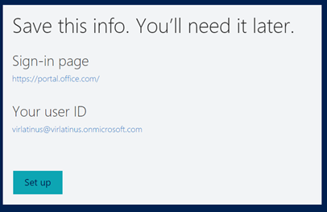
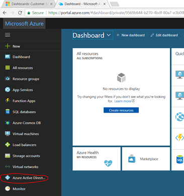
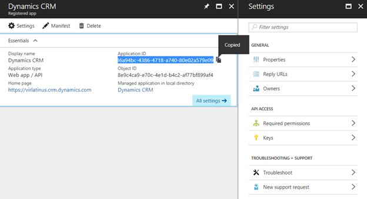
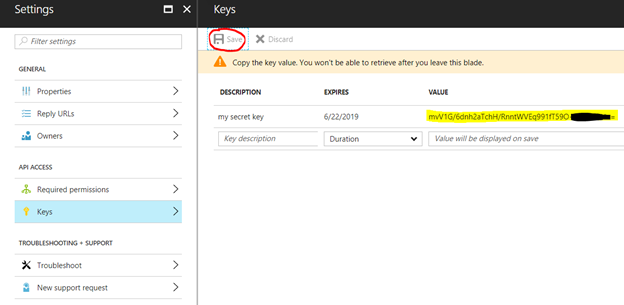
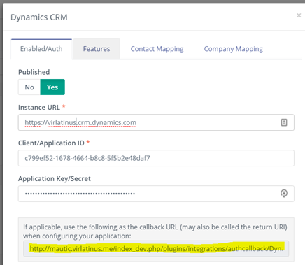
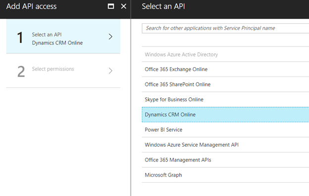
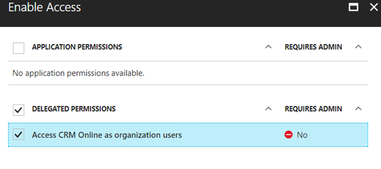
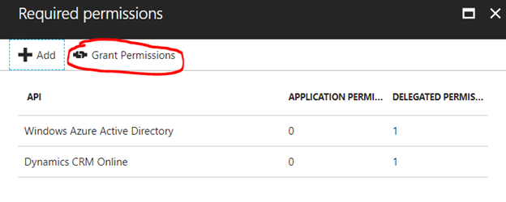

# Plugin bi-directionnel - Mautic et Microsoft Dynamics CRM

Ce plugin permet de pousser et récupérer les contacts vers et depuis Microsoft Dynamics CRM quand un contact fait des actions ou lorsque vous exécutez une action de synchronisation de contacts.

Si nous n'avez pas de compte Microsoft Dynamics CRM, suivez les instructions créez vous un compte free trial.

## Configuration du plugin Dynamics CRM

1. Insérez l'URL de votre compte Microsoft Dynamics CRM, l'ID de l'application et le Secret ID dans le plugin Mautic et autorisez la connexion. Publiez la connexion et sauvegardez.

2. Sélectionnez en suite les fonctionnalités que vous souhaitez intégrer dans l'onglet Fonctionnalités. *Envoyer les contacts vers l'intégration* est déjà activé par défaut.
3. Configurez la [correspondance des champs](./../plugins/field_mapping.html).
4. Sauvegardez la configuration du plugin.

## Testez le plugin

Suivez [ces étapes](./../plugins/integration_test.html) pour tester l'intégration.

#### Créer un compte de test gratuit Microsoft Dynamics 365
#### Paramétrer Microsoft Dynamics 365
1. Allez sur [le site de test Dynamics 365](https://www.microsoft.com/en-us/dynamics/free-crm-trial.aspx)

#### Configurez Azure
1. Allez sur le [portail Azure](https://portal.azure.com)
2. Connectez vous avec votre compte onmicrosoft.com

3. Allez dans 'Azure Active Directory'

4. Ajoutez l'enregistrement d'une nouvelle application

5. Remplissez les informations de l'application CRM

6. Cliquez sur créer
7. Cliquez sur l'application que vous venez de créer

8. Récupérer l'ID d'application que vous utilisez dans le plugin dans Mautic

9. Ajoutez une nouvelle clé. Donnez lui le nom de votre choix et copiez la valeur. Vous aurez à l'utiliser dans le plugin dans Mautic

10. Configurez l'URLs de réponse en utilisant les callbacks dans les paramètres du plugin dans Mautic. Cliquez sur sauvegardez.

11. Configurez les permissions requises. Cliquez sur ajouter

12. Ajoutez l'accès API pour Microsoft Dynamics CRM Online. Cliquez sur sélectionner.

13. Autoriser l'accès à Dynamics CRM pour les utilisateurs. Cliquez sur sélectionner puis valider.

15. Activez les permissions en cliquant sur "Obtenir Permissions". Puis Oui.

16. Retournez dans Mautic
17. Autorisez le plugin

18. Utilisez votre compte onmicrosoft.com pour vous identifier

19. Le plugin est prêt. Vous pouvez tester en utilisant l'action "Envoyer les contacts vers l'intégration" dans les formulaires, campagnes et points.
20. Vous pouvez également tester en utilisant : `php app/console mautic:integration:fetchleads -i Dynamics`
