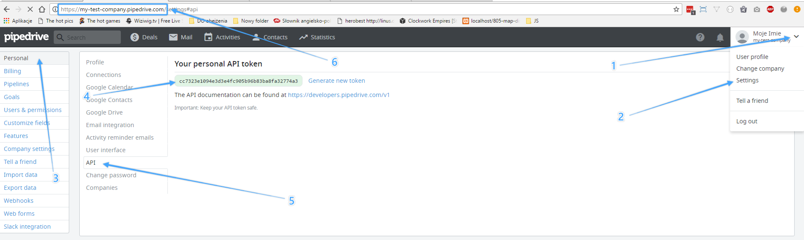
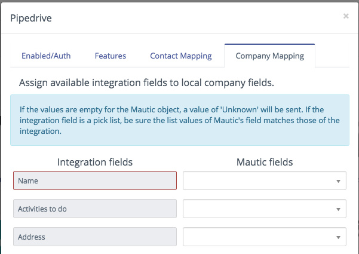
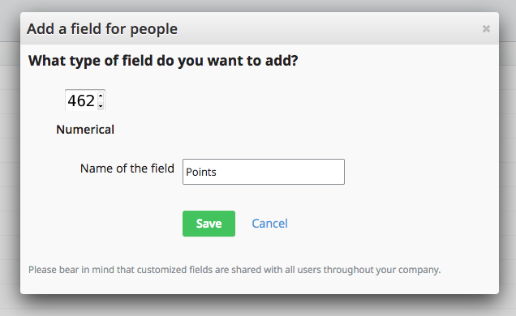
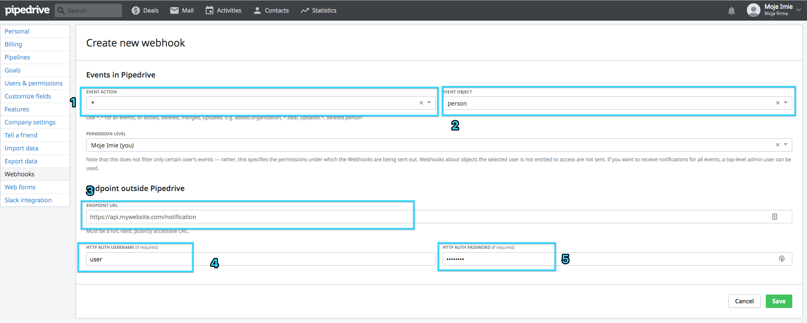

# Plugin Mautic - Pipedrive CRM

Ce plugin permet la synchronisation entre Mautic et Pipedrive. Si vous n'avez pas de compte Pipedrive pour le moment, créez en un ici : https://www.pipedrive.com

# Configuration du plugin dans Mautic
Pour intégrer Mautic avec Pipedrive, remplissez les champs suivants :

1. URL vers Pipedrive API
2. Token API Pipedrive
3. Webhook utilisateur : le nom d'utilisateur de votre choix (utilisé dans les webhooks Pipedrive)
4. Webhook mot de passe : mot de passe de votre choix (issu de Pipedrive)

Récupérez l'URL et les tokens API depuis Pipedrive. L'URL est la même que celle de votre compte Pipedrive en y ajoutant _/v1_ à la fin. Dans cet exemple, l'URL ressemblerait à : `https://my-test-company.pipedrive.com/v1`.

Lorsque vous remplissez les informations du plugin pour la première fois, paramétrez "champs publiés" à Non. Lorsque vous sauvegardez et ouvrez la popin de configuration à nouveau, vous pourrez faire la correspondance des champs envoyées par l'API Pipedrive. Faites la correspondance des champs de votre choix, activez l'intégration en cliquant sur plublier et commencer la synchronisation.

**Soyez très attentifs lors de la correspondance des champs de manière à ne pas corrompre les données.**

# Fonctionnalités

### Sociétés

Pour activer la synchronisation des sociétés, allez dans l'onglet fonctionnalités du plugin et cochez *Sociétés / Organisations* :

Après avoir enregistré et fermé le plugin vous pourrez faire la correspondance des champs de société envoyés par Pipedrive.

### Contact Owners

Le plugin peut également assigner un propriétaire aux contacts et aux sociétés. Si vous avez un utilisateur avec la même adresse adresse email dans Pipedrive et dans Mautic, le plugin fera la synchronisation automatiquement.

### Points

Vous pouvez également faire une correspondance sur le champ point de vos contacts. Pour procédé ainsi, suivez les instructions suivantes :

Ceci étant fait, ouvrez la page de configuration du plugin dans Mautic pour trouver la nouvelle option de correspondance :

# Configuration du plugin dans Pipedrive

Pour échanger les données entre Pipedrive et Mautic, il faut configurer des webhooks dans Pipedrive pour mettre à jour automatiquement et instantanément Mautic.

Il faut créer une webhooks les Contacts, Utilisateurs et optionnellement pour les Sociétés.

1. Sélectionnez `\*` pour envoyer à Mautic tous les éléments d'un objet donné
2. Choisissez l'objet que vous souhaitez synchroniser (Contact, Société, Utilisateur)
3. Collez l'URL de votre instance Mautic
4. Entrez la webhook user utilisée pour la configuration du plugin
5. Idem pour le mot de passe

Répétez l'action pour chaque objet (contact, société utiisateur). Lorsque c'est fait, la webhook devrait ressembler au screenshot suivant.

# Commandes

Les commandes suivantes sont utilisées uniquement pour la synchronisation initiale. Elles ne doivent pas être ajoutée aux CRON.

* `mautic:integration:pipedrive:fetch` – récupère les données de Pipedrive vers Mautic
* `mautic:integration:pipedrive:push` – pousse les données de Mautic vers Pipedrive
